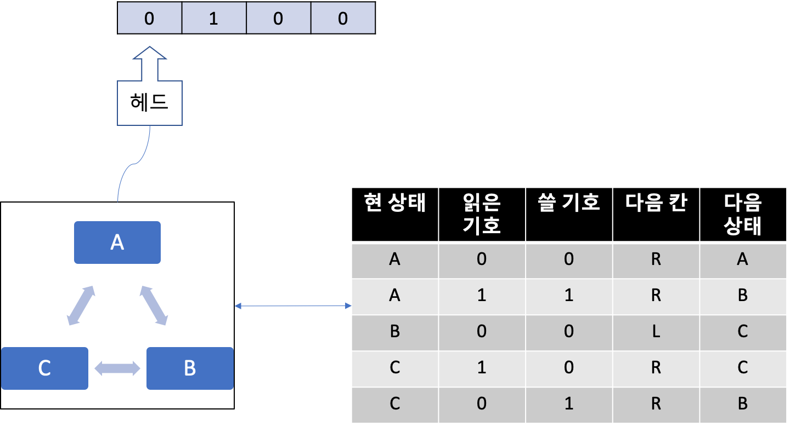

# 튜링머신의 등장

매년 노벨상 시상식 즈음되면 온 세계가 시끌벅적하다. 많은 분들이 이미 언론을 통해서 알고 있겠지만 노벨상은 여러 학문 분야마다 시상한다. 노벨상 시상 분야에는 평화, 문학, 화학, 물리, 생리/의학, 경제학은 있지만 컴퓨터 분야는 없다. 노벨이 살아있을 당시 컴퓨터라는 물건은 존재하지 않았으니까. (참조: 뒤끝) 대신 컴퓨터 과학계에서는 노벨상에 비견되는 튜링상(Turing Award)이라는 상이 있다. 이 상의 이름은 컴퓨터의 탄생에 지대한 업적을 남긴 20세기 영국의 수학자 앨런 튜링(Alan Turing)에서 따왔다. 어느 정도 지대한가 물으면 앨런 튜링은 "컴퓨터의 과학의 아버지의 아버지"라고 불릴 정도이며 현대 컴퓨터의 구조는 모두 그가 설계한  튜링머신을 기반으로 하고 있다는 말로 대신하겠다. 따라서 컴퓨터 과학계 최고 권위를 나타내는 상의 이름은 당연히 '튜링상'이다.

## 20세기 수학자들의 꿈과 희망

컴퓨터는 튜링이 "내가 이런 멋진 기계를 만들어보겠다!"라고 작정을 하고 만든 물건이 아니었다. 재미있게도 20세기 수학자들의 꿈과 희망을 짓밟는 과정에서 나온 부산물에 불과했다.

20세기 초 독일의 다비트 힐베르트(David Hilbert)라는 위대한 수학자가 있었다. 흔히 "힐베르트 문제"라는 이름으로 불린 수학계에서 20세기에 풀어야할 가장 중요한 문제 23개 문제를 제시한 천재 수학자였다. 힐베르트는 꿈이 하나 있었다. 지금까지 수학자들이 어떠한 문제를 증명하기 위해 해왔던 과정을 자신이 살펴보니 몇 개의 추론 규칙을 반복해서 적용하는게 전부였다. 이런 규칙들을 찾아서 이를 기계적인 방식, 즉 자동으로 추론해주는 기계를 만들면 수학자들이 더 이상 고생하지 않으리라는 꿈이었다.

당시 수학계의 거장이었던 힐베르트의 이 제안은 유럽 수학계를 꿈과 희망에 부풀게 하기 충분했다. 그러나 이 꿈과 희망은 고작 3년 밖에 가질 못했다. 당시 25세에 불과한 신참내기 수학자 쿠르트 괴델(Kurt Gödel)이 자신의 논문 "《수학 원리》 및 관련 체계에서 형식적으로 결정될 수 없는 명제에 관하여1"을 통해서 힐베르트의 주장은 절대 이루어질 수 없다고 수학적으로 증명해버린 것이었다.

쿠르트 괴델의 사진. 출처: [위키피디아](https://commons.wikimedia.org/wiki/File:1925_kurt_g%C3%B6del.png)

어떤 가설을 반박하기 위한 가장 쉬운 방법 중 하나는 그 가설의 반례를 들면 된다. "불완전성 정리"라고 불리는 이 증명은 기계적인 방법만으로는 참인지 거짓인지 판단할 수 없는 명제가 항상 존재하기 때문에 힐베르트가 고안한 기계는 불가능하다는 사실을 수학적으로 증명했다. 이 정리는 복잡하기 때문에 여기서 설명할 내용은 아니니까 관심있는 사람은 [위키](https://ko.wikipedia.org/wiki/%EA%B4%B4%EB%8D%B8%EC%9D%98_%EB%B6%88%EC%99%84%EC%A0%84%EC%84%B1_%EC%A0%95%EB%A6%AC)를 참조하기 바란다. 아무튼 괴델의 이 증명은 꿈과 희망에 부풀어있는 수학계를 발칵 뒤집어놓기에 충분했다. 그리고 수학자들마다 괴델의 증명을 확인하는 과정에서 이 증명이 맞다는 사실을 알게 된다.

## 앨런 튜링

앨런 튜링이 괴델의 증명을 접한건 1935년, 튜링이 막 케임브리지 대학의 수학과를 졸업한 때였다. 맥스 뉴먼 수학과 교수가 개설한 괴델의 증명에 대한 강의를 들은 튜링은 자신만의 방법으로 다시 증명할 수 있겠다고 생각했다. 이내 튜링은 자신의 생각을 정리해서 <계산 가능한 수에 대해서, 수리명제 자동생성 문제에 응용하면서>라는 제목으로 약 1년 후에 런던 수리학회에 논문을 제출했다.

논문 제목만 보면 컴퓨터와 전혀 상관 없을 것 같지만 훗날 앨런 튜링의 컴퓨터 공학의 아버지의 아버지라고 불린 이유가 바로 이 논문에서 괴델의 증명을 다시 한 번 증명하는데 쓰인 상상 속의 기계가 훗날 현대 컴퓨터의 원형이 되는 물건이었기 때문이다. 튜링은 이 논문에서 모든 계산을 할 수 있는 보편적 만능기계(Universal Machine)을 제시했다. 즉 힐베르트가 꿈꾸던 기계를 먼저 설계하고, 이 기계로도 풀 수 없는 문제가 있다는 반례를 제시함으로서 힐베르트의 주장이 이루어질 수 없다는 사실을 다시 한 번 증명했다.

이 논문에서 튜링이 정의한 기계(이하 튜링 머신)는 고작 몇 개의 굉장히 단순한 부품으로 이루어져 있다. 

1. 테이프

일정한 크기의 셀(Cell)로 나뉘어 있는 종이 테이프. 각 셀에는 기호가 기록되어 있으며 길이는 무한히 늘어날 수 있다.

2. 헤드 

테이프의 특정 한 셀을 읽고 쓰거나 좌우로 이동할 수 있는 제어장치

3. 행동표

영어로는 Action Table이지만 한국어로는 명령테이블, 규칙표 등 다양한 이름이 존재한다. 현재 상태와 기호에 따라 할 일(Action)을 지정한 표(Table)다. 행동표에 의해서 튜링머신은 헤더를 오른쪽이나 왼쪽으로 움직일 수 있으며 헤더에서 기호를 읽어들일 수 있고 헤더를 통해 테이프의 내용을 다시 쓸 수도 있다. 또한 행동표에 의거 현재 기계의 상태를 변경할 수 있다.

4. 상태 기록기

기계의 상태를 기록한다.

단순한 부품으로 이루어진 기계답게 튜링머신이 하는 일은 단순하다. 테이프 칸의 기호를 읽고 쓰면서 테이프 왼쪽이나 오른쪽으로 움직이는 일 뿐이다. 이 와중에 기계의 상태가 매번 변경되거나 유지된다.

그밖에 기계장치는 아니지만 테이프에 쓸 수 있는 유한한 기호의 집합, 튜링 머신이 가질 수 있는 상태 집합이 있다. 그 중 상태에는 2가지 상태가 들어간다.

개시 상태(Start state): 상태 기록기가 초기화된 상태
종료 상태(Halt state): 수행이 종료된 상태

백문이 불여일예제다. 실제 예제를 들어서 설명해보겠다.

현재 기계의 상태가 A라고 가정한다. 그리고 테이프에서 첫 번째 칸을 읽는다. 예제에서는 0이다. 그렇다면 작동규칙표에서 현 상태 A와 읽은 기호가 0인 규칙을 찾는다. 첫 번째 줄이 해당 규칙이다. 이 규칙에 의거 읽은 곳에 0을 덮어 쓰고, 헤더를 오른쪽(R) 한 칸 이동하고 기계의 상태를 A로 바꾼다.

헤더는 다시 테이프를 읽는다. 방금 전 오른쪽으로 한 칸 이동했기 때문에 테이프의 2번째 칸 - 1이다. 현재 기계 상태가 A이고 읽은 기호는 1이기 때문에 작동규칙표의 두 번째 줄이다. 이 규칙에 의거 읽은 곳에 1을 쓰고 헤더를 오른쪽으로 한 칸 이동, 기계 상태를 B로 바꾼다.

헤더는 다시 테이프를 읽는다. 방금 전 오른쪽으로 한 칸 이동했기 때문에 테이프의 3번째 칸 - 1이다. 현재 기계 상태가 B이고 읽은 기호는 0이기 때문에 작동규칙표의 세 번째 줄이다. 이 규칙에 의거 읽은 곳에 0을 쓰고 헤더를 이번엔 왼쪽으로 한 칸 이동, 기계 상태를 C로 바꾼다.

헤더는 다시 테이프를 읽는다. 방금 전 왼쪽으로 한 칸 이동했기 때문에 테이프의 2번째 칸 - 1이다. 현재 기계 상태가 C이고 읽은 기호는 1이기 때문에, 작동규칙표의 네섯 번째 줄이다. 이 규칙에 의거 읽은 곳에 0을 쓰고 헤더를 오른쪽으로 한 칸 이동하고, 기계 상태를 C로 그대로 둔다.

헤더는 다시 테이프를 읽는다. 방금 전 오른쪽으로 한 칸 이동했기 때문에 테이프의 3번째 칸 - 1이다. 현재 기계 상태가 C이고 읽은 기호는 0이기 때문에, 작동 규칙표의 다섯 번째 줄이다. 이 규칙에 의거 읽은 곳에 1을 쓰고 헤더를 오른쪽으로 한 칸 이동, 기계 상태를 B로 바꾼다.

이 기계는 규칙표에 따라서 다양한 일을 할 수 있는데, 0만 쓰거나 1만 쓰거나 0과 1을 번갈라가면서 쓰는 일을 할 수 있고 사칙연산도 할 수 있다.

이쯤에서 우리 주변의 컴퓨터와 튜링머신을 비교해보면, 유사점을 많이 찾을 수 있다. 테이프는 메모리, 테이프에 읽고 쓰는 헤드는 메모리 입출력 장치, 작동규칙표는 CPU이며 테이프에 쓰인 기호의 집합은 현재의 소프트웨어라 볼 수 있다.

#### 뒤끝

노벨 의학상은 의사가 받는게 아니라 보통 화학자가 받는 이유와 노벨 컴퓨터상이 없는 이유는 동일하다.
