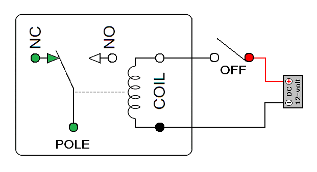
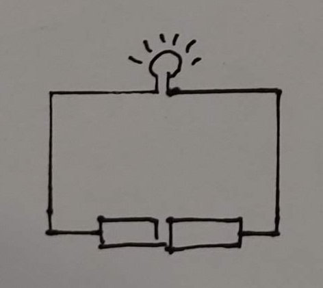
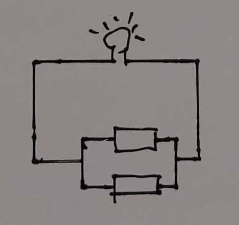

# 디지털의 등장

현대 컴퓨터의 원리는 튜링이 세웠다고 하지만 만약 상태 기록기가 기계식이었다면? 전자 회로를 별 이론적 체계가 없이 주먹구구식으로 만들었다면 개인용 컴퓨터가 집집마다 있고 모든 사람들 손에 스마트폰이 있는 세상은 오지 않았을 것이다. 대신 컴퓨터는 어마어마한 크기를 자랑하면서 대학교에나 가야 구경할 수 있는 진기명기가 되었을 것이다.

## 클로드 섀넌

클로드 섀넌. 출처: [위키피디아](https://commons.wikimedia.org/wiki/File:ClaudeShannon_MFO3807.jpg)

1936년 MIT를 졸업하고 전기공학으로 석사과정을 공부하던 클로드 섀넌(Claude Shannon)은 초기 아날로그 컴퓨터인 미분해석기를 연구하고 있었다. 섀넌은 특히 미분해석기의 전자 릴레이에 큰 흥미가 있었다. 전자 릴레이는 간단하게 말해서는 ON/OFF가 있는 일종의 스위치인데, 거실 불을 켜고 끌 수 있는 전등 스위치와는 다르게 이 릴레이는 자동으로 ON/OFF를 할 수 있게 해주는 전자부품이다. 내부에는 전자석이 있어서 전류가 걸리면 자성이 생겨서 스위치가 ON이 되며 전류가 없으면 자성이 없어져서 스위치가 OFF가 된다.

전자석의 동작 원리. 출처: [네이버 블로그](https://m.blog.naver.com/roboholic84/220460268471)

섀넌은 미분해석기의 논리 회로를 연구하면서, 부울(Bool) 논리식이 곧 스위치 회로가 같다는 사실을 깨달았다. 이 깨달음을 바탕으로 1937년 "계전기와 스위치로 이루어진 회로의 기호학적 분석"라는 기념비적인 "석사" 논문을 발표했다. 고작 25페이지에 불과한 이 탈석사급 레전드 논문은 이후 모든 디지털 컴퓨터의 설계에 영향을 미쳤다.

그렇다면 부울 논리식은 무엇이고 스위치는 어떻게 동작하는지 알아보자. 

## 부울 논리식

1854년 영국 수학자 조지 부울(George Boole)은 "논리와 확률의 수학적 기초를 이루는 사고(思考)의 법칙 연구"이라는 책을 발표한다. 부울은 이 책에서 모든 명제(혹은 인간의 생각)은 AND, OR, NOT으로 결합하여 표현할 수 있다 보았고 이렇게 결합한 명제가 어떻게 참과 거짓으로 결정되는지 정리했다.

### AND (그리고)

명제을 결합하는 방법 중 하나인 AND, 한국어로는 '그리고'는 두 명제를 결합했을 때 두 생각 모두가 참이면 그 결합한 결과 역시 참이다. (배우) "박서준은 남자다"라는 명제와 "박서준은 배우다"라는 명제를 합치면 "박서준은 남자다 그리고 배우다"라는 말이고 참이 된다. 허나 두 명제 중 하나라도 거짓이면 AND의 결과는 "박서준은 여자다 그리고 배우다" 처럼 거짓이 된다. 이렇게 AND의 경우 명제A와 명제B가 모두 참이여야 참이 된다. 참을 1, 거짓을 0으로 표현하면 아래와 같다,

| A | B | AB |
| - | - | - |
| 1 | 1 | 1 |
| 0 | 1 | 0 |
| 1 | 0 | 0 |
| 0 | 0 | 0 |

### OR (또한)

명제를 결합하는 방법 중 또 다른 하나인 OR, 한국어로는 '또한'은 두 생각을 결합했을 때 두 명제 중 최소 하나가 참이면 그 결과 역시 참이다. '1 + 1 = 2이다.'와 '1 + 2 = 2이다.'라는 명제가 있다면 두 생각을 OR로 결합하면 '1 + 1 = 2이다 또는 1 + 2 = 2이다'이라서 참이 된다. 다만 '1 + 1 = 3이다 또는 1 + 2 = 2이다'은 두 명제 모두 거짓이기 때문에 이 결과도 거짓이다. 이를 표로 표현되면 아래와 같다. 

| A | B | A+B |
| - | - | - |
| 1 | 1 | 1 |
| 0 | 1 | 1 |
| 1 | 0 | 1 |
| 0 | 0 | 0 |

### NOT (아닌)

명제를 결합하는 마지막 방법인 NOT, 한국어로는 '아니다'는 참 거짓 여부가 반대로 된다. 예를 들어 "나는 살아있다"라는 명제가 있다. 물론 이 글을 읽고 있을테니까 참이겠다. 이를 NOT을 붙이면 "나는 살아있지 않다"가 되고 이는 당연히 거짓이 된다. 또한 "1+1은 3이다"는 거짓이다. 여기에 NOT을 붙이면 "1+1은 3이 아니다"가 된다. 이는 참이 된다. 이를 표로 표현되면 아래와 같다. 

| A | -A |
| - | - |
| 1 | 0 |
| 0 | 1 |

### 결합

결합된 명제는 레고블럭처럼 다른 명제와 결합하는데 사용할 수 있다. 물론 결합은 AND, OR, NOT 이렇게 3가지 결합 방식을 사용해야 한다. 이렇게 명제를 계속해서 결합하면 더 큰 명제를 만드는데 쓰일 수 있다. 

## 스위치

초등학교 과학 시간에 전구와 건전지, 전선을 가지고 전기에 대해서 배운 적이 있을 것이다. 이때 배우는 중요한 개념 중 하나가 직렬과 병렬이다. 

예를 들어 건전지 2개를 직렬로 연결한 경우와 병렬로 연결한 경우를 살펴보자.
직렬 연결의 경우 이 건전지 2개 중 하나를 빼버리면 전구에 불이 안 들어온다. 

병렬 연결의 경우 이 건전지 2개 중 하나를 빼도 좀 어두워질지언정 불은 들어 온다. 병렬 연결의 경우 전구의 불을 끄려면 모든 전지를 빼내야 한다. 

스위치의 배치도 마찬가지다. 전기가 왼쪽에서 오른쪽으로 흐른다고 가정한다면 직렬로 배치할 경우 두 스위치가 모두 ON이 되어야지 전기가 흐르며, 병렬로 배치할 경우 두 스위치 중 하나만 ON이 되어도 전기가 흐른다. 이쯤되면 눈치챈 사람도 있을텐데 직렬과 병렬은 각각 부울의 AND와 OR와 동일하다!

부울의 NOT에 해당하는 스위치도 동작 방식이 NOT과 똑같다. 결과가 무조건 반대인 NOT 스위치는 일종의 수문과 같다. 닫으면(ON) 단절되고 열면(OFF) 흐르는 스위치다.

## 그래서 뭐 어쩌라구?

다시 섀넌의 "석사"논문으로 돌아가자. 이 논문의 제목은 "계전기와 스위치로 이루어진 회로의 기호학적 분석"인데, 계전기와 스위치만으로 이진수의 사칙연산이 가능하다는 것을 증명한 논문이었다. 이 논문의 파급력이나 중요성은 석사급의 그것이 아니었다. 박사급 아니 "레전드" 급이었다. 이 논문은 이후 전자식 디지털 컴퓨터의 이론적 기반이 된다.

셰넌이 공부하던 시절인 1930년대 전기 공학자들은 이 전자 릴레이를 이용하여 다양한 전자 회로를 만들고 있었다. 주로 이 전기 스위치를 '직렬' 혹은 '병렬' 혹은 '뒤집기'형태로 조합해서 원하는 작업을 할 수 있는 회로를 만들고 있엇는데, 공학은 공학이었지만 체계가 없었고 주먹구구식이었다. 이론과 체계가 없이 경험과 개개인의 스킬에 의존하면 더 크고 복잡한 제품을 만들지 못한다. 섀넌의 논문은 이 과정을 부울 논리로 깔끔하게 정리해주었다. 즉 스위치 회로 설계가 부울 대수 문제와 같다는 이야기로, 이는 곧 스위치 회로 설계의 이론적인 토대가 된다.

이후 이 전자회로 설계가 체계화되어 디지털 논리회로라는 이름으로 불리게된다.

참고: 
http://www.jobitoday.com/news/articleView.html?idxno=15853