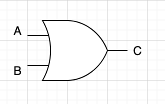

# 디지털 논리 설계

디지털 논리 설계는 부울 대수에서 배웠던 AND, OR, NOT을 이용해서 유용한 디지털 회로를 체계적으로 설계하는 방법이다. 이를 위해선 몇 가지 순서가 있다.

1. 입력 값과 출력 값을 정한다.
2. 진리표를 만든다
3. 진리표를 부울 대수로 간략하게 나타낸다.
4. AND, OR, NOT 등의 스위치를 이용, 회로로 표현한다.

## 단계 1. 입력 값과 출력 값을 정한다

학습에 도움이 되기 위해, 문이 열리거나 사람의 움직임에 따라 자동으로 불이 켜지는 시스템을 설계해보자. 다만 전등 스위치가 켜져 있어야 한다. 이 상태에서 사람의 움직임을 인식하면 움직임 감지 센서가 이를 탐지해서 불이 켜져야 한다.

따라서 입력 값은 문의 열림을 탐지하는 센서가 주는 값, 사람의 움직임을 감지하는 센서가 주는 값, 전등 스위치 C의 ON/OFF 상태다.

출력은 단순하다. 전등이 켜지고 꺼짐이다.

## 단계 2. 진리표를 만든다

입력 값에 해당하는 센서와 스위치의 상태를 명제로 나타내면 아래와 같다.

x: 문이 열렸다.   
y: 사람의 움직임이 탐지되었다.    
z: 전등 스위치가 ON이다.    
A: 전등이 켜진다.   

각 센서와 스위치 상태에 따라 출력값을 진리표로 정리해보면 다음과 같다.

| x | y | z | A |
| - | - | - | - |
| 0 | 0 | 0 | 0 | 
| 1 | 0 | 0 | 0 | 
| 0 | 1 | 0 | 0 | 
| 1 | 1 | 0 | 0 |
| 0 | 0 | 1 | 0 |
| 0 | 1 | 1 | 1 | 
| 1 | 0 | 1 | 1 | 
| 1 | 1 | 1 | 1 |  

## 단계 3. 진리표를 부울식으로 간략하게 나타낸다.

이 진리표를 표현하는 방법은 2가지가 있다. 하나는 부울식이며 하나는 기호로 표현할 수 있다. 부울식에서 AND, OR , NOT은 아래와 같이 표현한다.
- AND는 2개의 피연산자(A,B)가 있으며 이를 AB 혹은 A.B로 표현
- OR는 2개의 피연산자(A,B)가 있으며 이를 A+B로 표현한다.
- NOT은 1개의 피연산자가 있으며 이를 -A혹은 O로 표현한다.

위의 진리표는 부울식으로 A = xy + z 와 같이 나타낼 수 있으며 이를 기호로 나타내면 아래와 같다. 아참, 그 전에 AND, OR, NOT을 기호로 표현하는 방식을 알아보자. 

선 2개를 받아서 하나를 내놓는 반달 기호는 AND(그리고)를 표현한다. 기호 2개는 피연산자를 나타내고 1개는 결과값을 나타낸다.

선 2개를 받아서 하나를 내놓는 초승달 기호는 OR(또는)를 표현한다. 입출력은 AND와 동일하다.

선 1개를 받는 삼각형과 작은 원이 조합된 기호는 NOT(아닌)을 표현한다. 피연산자는 1개 뿐이며 역시 1개의 결과값을 나타낸다.

## 단계 4. AND, OR, NOT 스위치를 이용, 회로로 표현한다.

마땅한 예제가 떠오르지 않아서 퇴근길에 만난 자동 불켜짐 시스템을 가지고 예제를 꾸며봤는데 예제를 완성하고 보니 이 예제의 단점은 NOT 스위치는 쓰지 않는다... 나중에 더 좋은 예제가 나오면 예제를 바꿔보도록 하고 아무튼 이를 회로로 표현하면 다음과 같다.

이 그림을 논리도(logic diagram) 혹은 회로도(circuit diagram)이라고 한다.

그런데 이거 어따 쓰나요? 음... 아래 그림같은 반도체 칩 본적이 있을지 모르겠다. 이건 IC7404칩의 사진이다.

7404칩은 NOT게이트 5개를 묶어서 사용하는 구조이다. 참고로 연산을 실제로 수행하는 하드웨어 소자를 게이트라고 한다.

14번과 7번은 전원을 제공하는 단자고 그 외 홀수 번은 입력, 짝수 번은 출력을 하는 단자이다. 위에서 예제로 든 자동 불켜짐 회로도 저렇게 하나의 칩으로 만들수 있다.

인텔이나 AMD가 만드는 CPU도 마찬가지다. 아래 회로도는 자일로그 Z80 CPU를 동작시키는 보드인데, 무슨 보드인지 이름을 모르겠지만, 여태까지 공부한 사람들은 대충 이게 뭔지는 보일 것이다.

CPU는 이런 스위치들이 굉장히 많이 모여 복잡한 일을 할 수 있는 장치라 보면 된다. 

## AND, OR, NOT 스위치로 기억회로 만들기

신기하게도 이 기본적인 스위치만으로 결과값을 기억할 수 있는 방법이 있다. 전혀 불가능한 일일것 같은데 아래의 회로를 살펴보자.

위 회로는 SR(set-reset) 래치라고 불리는 회로다. 여기서 S(set)는 출력 1을, R(reset)은 출력 0으로 되도록 한다는 의미이며, 저장된 현재 상태출력은 Q로 표시한다. 아 OR에 NOT을 의미하는 동그라미가 달린 게이트는 NOR게이트라고 불리며 진리표는 아래와 같다.

| A | B | A NOR B |
| - | - | - |
| 0 | 0 | 1 |
| 0 | 0 | 0 |
| 0 | 0 | 0 |
| 0 | 0 | 0 |

보통 현업에서는 AND, OR 자체보다는 NAND, NOR, XOR, XAND 의 조합을 주로 많이 쓴다고 한다.

위의 상황을 수학식으로 표현해보자.

이 식에 따라 S와 R의 상태값 조합으로 메모리 Q에 0 혹은 1 값을 유지할 수 있다.
S=1, R=0의 경우를 보자. 직관적으로는 그냥 1을 기억하라(Set)이라 할것 같은데 그게 맞다. S=1이기 때문에 Q'는 무조건 0이며 Q는 1이 된다. S와 R이 모두 0이면 Q는 1이다. S, R이 계속 0이면 Q는 계속 1값을 유지(저장)한다. 0을 쓰고 싶으면 왠지 리셋(Reset)하면 될 것 같은데 그게 맞다. S=0, R=1을 넣으면 Q는 0이 된다. 그 다음 S, R이 계속 0이 들어오면 Q의 값은 계속 0이 된다.

이 회로를 플립플롭(flip-flop) 혹은 래치라고 한다. 우리가 흔히 쓰는 메모리는 이 플립플롭이 모여서 구성된 장비이며 각 플립플롭마다 0 또는 1의 값을 저장하고 있다.
