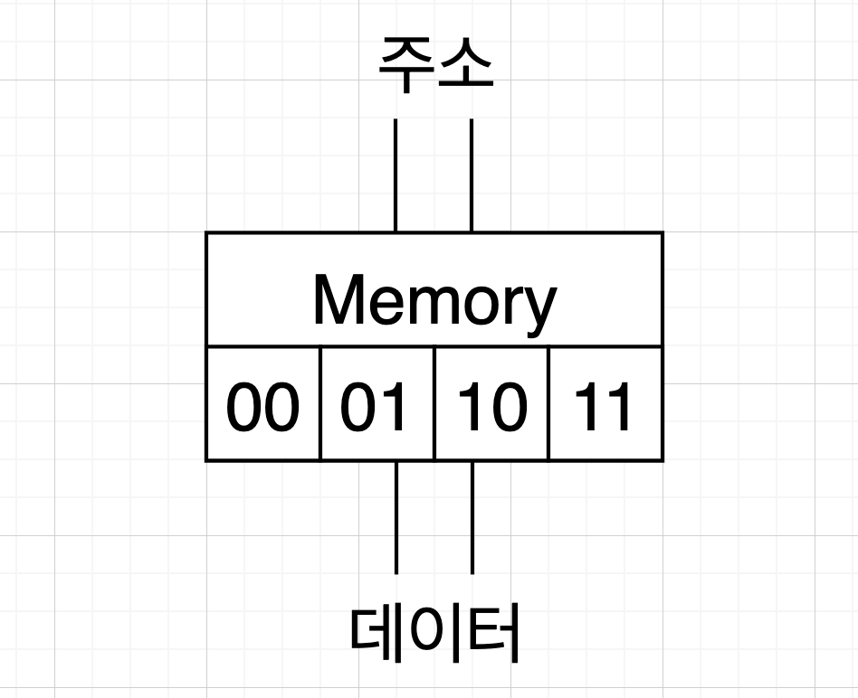
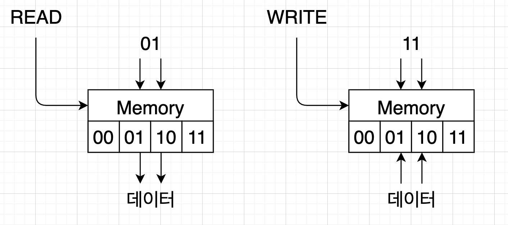

# 메모리

흔히 우리가 RAM이라 불리는 장치가 메모리다. 튜링 머신의 테이프에 해당하는 장치이며 폰 노이만 구조의 '임의 접근이 가능한 메모리'에 해당한다. 컴퓨터가 수행해야할 명령어를 저장하거나 연산에 필요한 데이터를 저장하는 목적으로 사용된다.

## 메모리의 원리

메모리는 수 많은 플립플롭 회로로 구성되어 있다. 챕터 1의 [디지털 논리설계](../ch1-computer-science-intro/section3-digital-circuit.md)의 마지막에서 언급한 0 혹은 1을 저장하는 회로가 바로 그것이다. 참고로 하나의 플립플롭이 저장하는 0 또는 1을 하나의 비트bit라고 하고 이 8비트를 1바이트byte라 부른다. 요즘 흔히 쓰는 16 기가바이트는 128,000,000,000개의 플립플롭 회로를 사용한다고 생각하면 된다. 그리고 메모리는 수 많은 셀로 나뉘어져 있는데, 이 셀마다 고유의 주소가 있어서 주소를 알면 바로 해당 주소에 해당하는 메모리의 값을 바로 읽을 수 있다.

메모리 동작 원리를 파악하기 위해 가장 간단한 4비트짜리 메모리를 예로 들겠다.

4비트 메모리는 주소가 총 4개가 있다. 각각 0, 1, 2, 3이라고 가정한다. 이를 이진수로는 00, 01, 10, 11이다. 그리고 이 주소 값을 넣어줄 전선 2개와 이 주소 값을 읽고 쓸 데이터를 위한 전선이 2개가 있다. 

편의상 위의 전선 2가닥이 주소 전선, 아래 전선 2가닥이 데이터 전선이라고 칭한다.

만약 메모리에 저장되어 있는 2번 주소의 데이터를 읽고 싶다면 주소 전선을 통해 읽을 주소인 10을 넣어준다. 그러면 메모리는 해당 주소에 저장된 값을 데이터 전선으로 내보낸다. 참고로 읽을 주소를 넣어줄 전선은 괜히 2개를 그려놓은게 아니다. 4개의 주소를 표현하기 위해서는 두 자리의 이진수가 필요하기 때문이다. 참고로 8개의 주소를 표햔하기 위해서는 3개의 전선이, 16개의 주소를 표현하기 위해서는 4개의 전선이 필요하다.

만약 3번 주소에 데이터를 쓰고 싶다면 주소 전선에 11을 넣고 데이터 전선에 쓸 데이터 값을 흘려넣으면 메모리 3번에 데이터가 저장된다. 그럼 같은 전선에 데이터를 내보내고 들여보내도 되냐고, 어떻게 읽고 쓰기를 구분하냐고 묻는 분이 계실테다.

메모리에는 READ와 WRITE를 구분하는 컨트롤 전선이 별도로 있다. READ일때는 주소 전선에서 주소 값을 읽어서 데이터 전선으로 저장 값을 내보내고 WRITE일 경우에는 주소 전선에서 주소 값을 읽어서 데이터 전선으로 들어오는 값을 해당 주소에 저장한다.

## 32비트 컴퓨터? 64비트 컴퓨터?

앞서 설명한 "읽거나 쓸 주소를 입력받는 전선", "데이터를 내보내거나 쓰는데 사용하는 전선"을 부르는 이름이 있다. 전자는 "주소 버스(Address Bus)"라고 부르며, 후자는 "데이터 버스(Data Bus)"라고 한다. 주소 버스가 1개의 전선으로 구성되어 있다면 2개의 주소만, 2개의 전선으로 구성되어 있다면 4개의 주소만 구분할 수 있다. 즉 전선 n개로 2의 n승만큼의 주소를 표현할 수 있다.

2 ^ 1 = 2   
2 ^ 2 = 4   
...   
2 ^ 32 = 4,294,967,296    

주소 버스가 32개의 전선으로 구성되어 있다면 4,294,967,296개의 주소를 표현할 수 있는데 1개의 주소가 1바이트이기 때문에 4,294,967,296바이트, 즉 4GB의 주소를 구분할 수 있다. 이 제한 때문에 주소 버스가 32개의 전선으로 구성된 - 즉 흔히 말하는 32비트 컴퓨터의 최대 램 용량은 기본적으론 4GB가 한계였다. 인텔 80386이 연 32비트 시대는 AMD가 AMD64 아키텍쳐를 열면서 근본적인 4GB 메모리 제약을 벗어날 수 있었다. 최근에 나오는 64비트 컴퓨터는 이론상으로 18,446,744,073,709,551,616 바이트 혹은 17,179,869,184 기가바이트, 혹은 16엑사바이트의 메모리를 장착할 수 있어서 당분간은 메모리 제약을 고려하지 않아도 된다. 문제는 언제나 여러분의 지갑 사정이다.

데이터 버스는 역시 주소 버스와 마찬가지다. 주소 버스처럼 표현할 수 있는 주소의 수가 중요하지 않지만 도로와 같이 넓으면 넓을수록 한 번에 전송할 수 있는 데이터의 크기도 커진다. 이 데이터 버스를 통해 CPU와 메모리 사이에 끊임없이 데이터를 주고 받는다. CPU는 메모리에서 명령어와 데이터를 읽어들이며 필요할 때마다 메모리에 값을 저장하기도 한다.
