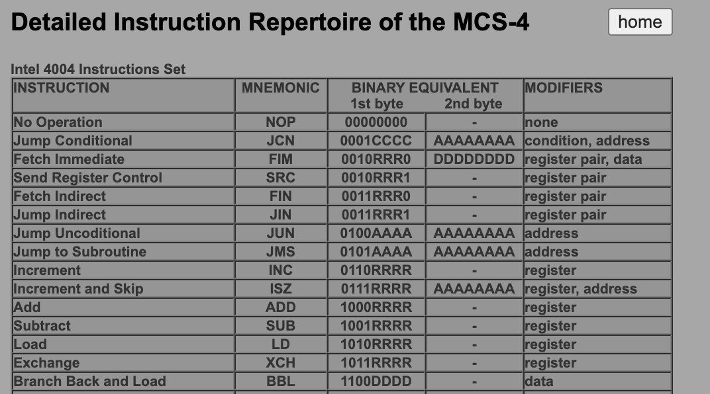

# CPU - 중앙처리장치

중앙처리장치, 혹은 프로세서(Processor) 혹은 CPU(Central Processing Unit)은 메모리에서 명령어를 읽어 그에 맞게 동작하는 장치다. 1장에서 설명한 튜링머신의 작동규칙표에 해당된다. 1장의 튜링머신의 동작에서 작동규칙표가 어떤 일을 했는지 기억해보자. 테이프에 쓰인 기호를 헤드를 통해서 읽고 기계의 현재 상태와 비교, 헤드를 통해 테이프에 특정 기호를 쓰고 헤드를 움직이는 역할이다. 이것이 바로 CPU의 역할이다.

먼저 CPU는 최대 3개의 피연산자를 사용하는 연산을 할 수 있다. 이 피연산자들의 정보는 CPU 내부에 있는 레지스터(Register)라고 하는 메모리에 저장되어 있다. CPU는 레지스터에 저장되어 있는 값으로만 연산을 수행하는 셈이다. 예를 들어 레지스터 B의 값을 A에 더해서 C에 넣으라거나 레지스터C에 1을 더하라던가 하는 일이 이와 같다. CPU는 메모리의 값을 직접적으로 불러와서 연산하지 않기 때문에 무조건 레지스터로 불러오거나 레지스터의 값을 메모리로 쓰는 명령어도 필요하다. 예를 들어 1번 메모리 값과 4번 메모리 값을 더해서 12번 메모리에 쓰고 싶다 한다면 다음과 같은 명령어가 필요하다. 

- 메모리 1번의 값을 레지스터 A에 넣어라
- 메모리 4번의 값을 레지스터 B에 넣어라
- 레지스터 A와 레지스터 B의 값을 더해서 레지스터 C에 넣어라
- 메모리 12번에 레지스터C의 값을 써라

이렇게 더하고 읽고 쓰는 연산을 명령어(Instruction)이라 하며 이 모든 집합의 연산을 명령어 집합(Instruction Set)이라고 한다. 참고로 아래는 시조새급 CPU 인텔 4004의 명령어 집합이다.(참고: [http://e4004.szyc.org/iset.html])

## CPU에 일 시키기

CPU에게 일을 시키려면, 즉 명령을 수행하려면 CPU가 알아먹을 수 있는 이진수로 작성해서 메모리에 저장해야 한다. 이 명령어 형식은 CPU마다, 아키텍쳐마다 다르다. x86 아키텍쳐 책만 읽어서 ARM에도 해당되는지는 확실치 않지만 컴퓨터 구조 책마다 동일한 설명을 하는것 보니 이 명령어 형태는 비슷할 걸로 예상한다. 명령어 형태는 초반 n비트는 Opcode - 한국어로 '명령 코드' -라 불리는 숫자가 있고 그 뒤로는 피연산자(Operands) 정보가 있다. 위에서 예시로 든 메모리 값을 불러서 더하고 그걸 다시 메모리에 쓰는 명령어를 기계어로 표현해보겠다.

일단 x86 아키텍쳐 말고 우리 만의 CPU k2020의 OpCode를 정의해보자.

| OpCode | MNEMONICS | Operand1 | Operand2 | Operand3 | 설명 |
| - | - | - | - | - | - |
| 1 | ADD | RRRR | DDDD | CCCC | 레지스터 주소 DDDD의 값과 레지스터 CCCC의 값을 더해서 레지스터 RRRR에 넣어라 |
| 2 | STORE | MMMM | RRRR |  | 레지스터 RRRR의 값을 메모리 주소 MMMM에 넣어라 |
| 3 | LOAD | MMMM | RRRR | | 메모리주소 MMMM의 값을 읽어서 레지스터 RRRR에 넣어라 |

OpCode, Operand 1, 2, 3은 각각 편의상 4비트라 하고 레지스터 A, B, C의 주소를 각각 1, 2, 3이라 가정한다.

그리고 앞에 말했던 내용을 CPU에게 일을 시켜보겠다.
- 메모리 1번의 값을 레지스터 A에 넣어라 (LOAD 0001 0001) -> 0011 0001 0001
- 메모리 4번의 값을 레지스터 B에 넣어라 (LOAD 0100 0010) -> 0011 0100 0010
- 레지스터 A와 레지스터 B의 값을 더해서 레지스터 C에 넣어라 (ADD 0101 0001 0010) -> 0001 0101 0001 0010
- 메모리 12번에 레지스터C의 값을 써라 (STORE 1100 0011) -> 0010 1100 0011

이 명령의 집합을 '프로그램'이라고 한다. 여러분들이 Javascript, Python, C/C++, Java 등으로 코딩을 하는 행위는 곧 CPU에게 명령을 내리기 위한 명령어를 짜는 행위다. 여러분의 코드를 명령어의 집합으로 바꿔주는게 컴파일러(Compiler)라고 하며, 이 명령어의 집합을 메모리에 올려서 CPU에게 일을 시키는게 운영체제다.

컴파일러와 OS도 보통 학과 3학년 이상에 배우는 과목으로, 컴퓨터 과학의 중요 과목 중 하나다. 이 두 개는 이번 장 뒤에 간략히 다루도록 한다.

### 추가 공부

본 내용은 컴퓨터 구조의 CPU에 나오는 내용입니다. 명령어 형식에도 여러 종류가 있습니다. k2020 아키텍쳐의 경우에는 2-address instruction 혹은 3-address instruction이라고 고정했지만 실제로는 0-address 도 있으며, 명령어 addressing 방식에 대한 설명, 파이프라인, 제어장치, 동기화 클럭 등 많은 부분을 생략했기 때문에 좀 더 상세한 내용을 알고싶으신 분은 컴퓨터 구조(Computer Architecture) 책을 읽어보시면 도움이 많이 됩니다.