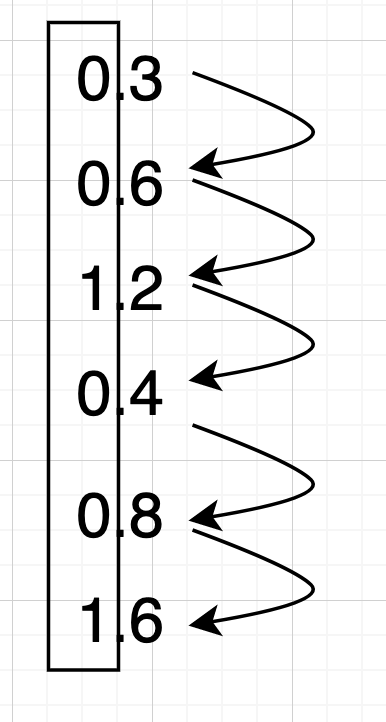

# 컴퓨터가 데이터를 다루는 방법

## 진법(numeral system)

사람은 10진법을 사용한다. 0부터 9까지의 숫자를 사용해서 무한대의 숫자를 표현한다. 반면 컴퓨터는 2진법(binary)을 사용한다. 높은 전압이 걸리면 1, 낮은 전압이 걸리면 0을 표현하며 0과 1로 무한대의 숫자를 표현하기 때문이다. 예를 들어보자.

5는 이진수로 101  
27은 이진수로 11011   
967은 이진수로 1111000111

10진수를 2수로 변환하는건 쉽다. 어떤 정수가 있다면 계속해서 2로 나눠주자. 예를 들어 10진수 27을 2진수로 변환하고 싶다면


여기서 나오는 나머지를 아래에서 위로 모으면 11101이 된다. 소수는 이 반대로 하면 된다. 예를 들어 0.3을 2진수로 변환하고 싶다면 2를 계속 곱해서 정수로 자리 올림이 나오면 1 아니면 0으로 기록하면 된다.



위에서부터 네모 부분을 차례대로 읽으면 001001이 되는데 직접 나눠보시면 알겠지만 끝자리가 계속 6, 2, 4, 8이 이어지면서 끝이 없는 소수, 즉 무한소수가 나온다. 10진수에서는 그냥 0.3으로 끝나는 유한소수지만 2진수에서는 무한소수가 된다. 비단 0.3뿐만 아니라 10진수에서는 딱 떨어지는 많은 유한소수가 이진수에서는 끝이 없는 무한소수가 된다. 따라서 컴퓨터는 최대한 0.3에 근사한 값을 표현할 수 있을 뿐이지 슬프게도 정확하게 0.3 이라고 표현할 수 없다.

## 16진수와 8진수

이진수는 컴퓨터가 사용하는 진법이기 때문에 숫자가 늘어나면 자릿수가 급격하게 늘어나고 무엇보다 사람이 알아보기 힘들다. 101111010011100101이 10진수로 몇 인지 내가 알게 뭐냔말이다. 그래서 사람이 볼 때는 10진법으로 바꾸기도 하지만 때에 따라서는 8진법(octal)이나 16진법(hexa-decimal)을 사용하기도 한다. 요즘은 혼동의 우려때문에 8진수를 잘 안쓰긴 하지만 컴퓨터에서 왜 2진법 외에 8진법과 16진법이 많이 사용되는 이유는 변환의 편의성 때문이다. 2진수를 3개씩 묶으면 8진수가 되고 2진수를 4개씩 묶으면 16진수가 된다.

예를 들어 위에서 10진수 967을 8진수로 내자면 이진수 1111000111을 3개씩 묶는다. 앞에서부터 묶는게 아니라 뒤부터 묶어야 한다. 8진수는 0~7까지 사용하기 때문에 1707이 된다.

1 111 000 111   
1  7   0   7 

16진수는 4개씩 묶는다. 참고로 16진수는 0~9와 A(10), B(11), C(12), D(13), E(14), F(15)을 사용한다. 괄호 안의 숫자는 10진수 값이다.

11 1100 0111    
3   C    7

따라서 1111000111는 16진수로 3C7이 된다. 보통 16진수는 0x를 붙여서 표기하기 때문에 위 숫자는 0x3C7이 되며 8진수는 01707처럼 앞에 0을 붙여서 표기한다. 8진수는 평소에 보기 힘들지만 16진법은 CSS에서 색상 표현할때 자주 마주할 수 있다. RGB형태로 색상을 표현할때 순수한 파란색은 Red가 0, Green이 0, Blue가 255이기 때문에 #0000FF로 표현한다. 10진수 255는 16진수 FF이기 때문이다.

## 정수 표현하기

수학시간에 정수에 대해서 배웠을 것이다. 정수는 자연수와 0 그리고 음의 정수의 집합이다. 컴퓨터 세계에서도 이 의미는 동일하지만, 컴퓨터의 한계 때문에 표현 방법과 범위가 약간 다르다. 여기서는 부호 있는 정수와 부호 없는 정수로 나눠서 설명하려고 신나게 쓰다가 생각해보니 이 글의 독자들은 대부분 이 내용을 알 필요가 없다. 여기서 설명하는 내용은 대부분 C/C++, Go, Rust 와 같이 결과물이 기계어로 된 실행 파일을 생성하는 언어를 사용할 때 알아야 할 내용이지 Python, C#, Javascript, Java와 같은 인터프리터나 VM상에서 동작하는 언어에서는 사실 이 내용을 반드시 알아야 할 필요가 없다. 이 책의 독자들은 대부분 후자이기 때문에 설명을 생략한다.

참고로 이 글에서 원래 다룰려는 내용은 기호를 표현할때 사용하는 MSB(Most Significant Bit), 연산을 위한 2의 보수 체계, Overflow/Underflow 및 Wrap-up 현상이 있다. 이는 나중에 기회될 때 중간중간에 언급할 기회가 있으리라 믿는다.

## 실수 표현하기

정수가 아닌 소수점이 있는 실수는 컴퓨터 입장에서는 표현하기가 정수보다 난이도가 훨씬 높다. 정수와는 다르게 값을 있는 그대로 저장하지 않고 약간은 특별한 형태로 데이터를 저장하고 표현하는 2가지 방법이 있다.

### 고정 소수점

말 그대로 소수점이 고정되어 있다. 예를 들어 13.74를 표현한다고 해보자. 이를 정수부 13과 소수부 .74로 나눈다. 이를 다시 2진수로 변환하면 정수부는 1011, 소수부는 10111101.... 이다. 고정 소수점 표현(fixed-point representation) 방식은 소수점을 특정 비트 위치로 고정하고 이 값을 특정 비트 앞을 정수부, 특정 비트 뒤를 소수부로 나눠서 표현한다는 점이다. **예를 들어** 16비트(2바이트) 구조에서 표현한다면 앞 8비트를 정수부, 뒤 8비트를 소수부로 나누어서 표현하고 앞에서 예를 든 13.74는 아래처럼 표현할 수 있다.

0.101111010111000010


고정 소수점 표현은 나름 숫자 표현이 간단하고 연산속도도 빠르지만, 표현할 수 있는 숫자의 범위가 제한적이라서 거의 사용하지 않는다고 봐도 무방하다. 그냥 교양으로 이런 방식이 있구나 정도로 알아두시면 된다.

### 부동 소수점

부동은 '부동자세'라는 말처럼 움직이지 않는다의 부동(不動)이 아니라 떠 다닌다는 부동(浮動)이다. 영어의 floating point 를 그대로 가져온 말이다. 뇌피셜로 아마 일본에서 먼저 들어온 말인듯하다. 고정소수점의 예제 숫자 0.74를 부동 소수점으로 어떻게 표현하는지 알아보자.

일단 컴퓨터에 저장을 위해 0.74를 2진수로 변환해보자. `0.10111101....`이다. 이를 정수부에 1이 오도록 소수점을 옮겨보자. 2의 -1승을 곱하면 `1.0111101...`이 된다. 이 값을 다르게 표현하면 `1.0111101 x 2^-1` 으로 표현할 수 있으며 이렇게 표현하는 방식을 정규화된 표기법(Normalized Notation)이라고 한다. 정규화된 표기법으로 변환한 상태에서 가수(fration/mantissa)와 지수(exponent), 그리고 부호를 나눠서 표기하는게 부동소수점 표현의 요지다. 참고로 `1.0111101`은 가수라고 하며 `2^-1`에서 -1을 지수라고 한다.


8비트 공간에서 부동소수점을 표현해보자. 부호를 표기하는 1비트가 필요하다. 0이면 양수 1이면 음수다. 그 다음 3비트는 지수를 표현하기 위한 공간, 남는 4비트는 가수를 표기하기 위한 공간으로 할당한다. 아까 2진수로 표현한 0.74를 8비트 공간에 표현하면 아래와 같다.


위 값을   
자세히 보자...    
자세히 보자....   
자세히 보자.....    

뭔가 이상한걸 못느끼는가?

### 초과 표현

아까 지수가 -1이니까 지수는 1이 오는게 아닌가요? 라는 질문이 있으면 제대로 짚었다. 지수를 표현할때는 보통 초과표현이라는 방법을 사용하는데 n개의 비트가 지수표현에 할당되었을때 `-(2^(n-1) - 1)`값을 기준값 0으로 잡고 표현하는 방법이다. 위의 예제는 지수 표현에 3비트를 잡았으니 `-(2^2 -1) = -3`을 0으로 잡는다. 위 공식에 의하면 지수가 -3이면 000, -2이면 001 -1이면 010, 0이면 011, 1이면 100, 2이면 101, 3이면 110, 4이면 111이 된다.

이렇게 표현하면 가장 큰 장점은 값의 비교가 굉장히 간단해진다. 단순히 지수만 비교하면 큰 값과 작은 값을 바로 구분할 수 있다.

### 실세계 사용

아까 예로 들었던 수 `0.74`를 보자. 이를 8비트 부동소수점 구조에 맞춰넣으면 가수부는 4비트이기 때문에 4자리 이후는 버림 처리되서 `1.0111 x 2^-1`이 된다. 정규화된 표기법의 역순으로 처리하면 `0.10111`이 된다. 이를 다시 10진수로 변경해보자.

= 0 * 2^0 + (1 * 2^-1) + (0 * 2^-2) + (1 * 2^-3) + (1 * 2^-4)+ (1 * 2^-5)   
= 0 + 1/2 + 0 + 1/8 + 1/16    
= 0 + 0.5 + 0 + 0.125 + 0.0625  
= 0.6875

원래 값이 0.74인데 저장하는 값은 0.6875라니!! 어떻게 이런 일이 일어나는 걸까?

이는 가수 정보를 저장하는 공간이 4비트밖에 없어서 발생한 일이다. 예를 들어 가수를 저장하는 공간이 4비트가 아니라 8비트라고 가정해보자. 0.74는 2진수로 `0.10111101011100001010001111...`인데 이를 정규화된 표기법으로 표기하되 가수부를 4비트가 아닌 8비트로 늘린다. 그럼 `1.01111010 x 2^-1`이 된다. 이를 다시 10진수로 바꿔보자

0 * 2^0 + (1 * 2^-1) + (0 * 2^-2) + (1 * 2^-3) + (1 * 2^-4) + (1 * 2^-5) + (1 * 2^-6)+ (0 * 2^-7)+ (1 * 2^-8) + (0 * 2^-9)  
= 0 + 1/2 + 0 +  1/8  +  1/16  +   1/32  +   1/64   + 0 +    1/256   + 0  
= 0 + 0.5 + 0 + 0.125 + 0.0625 + 0.03125 + 0.015625 + 0 + 0.00390625 + 0  
= 0.73828125

짠! 가수부를 2배 늘렸는데 아까의 0.6875보다 훨씬 0.74에 근접하게 표현할 수 있다. 부동 소수점은 지수를 저장하는 공간이 크면 더 많은 수를 표현할 수 있고 가수를 저장하는 공간이 크면 정확도가 높아진다. 

누군 가수부가 10비트 누군 20비트 이러면 혼란이 오기 때문에 IEEE라는 국제기구에서 컴퓨터에서 부동소수점을 표현하기 위한 표준을 제정했다. `IEEE743`라는 표준이 그것인데, 여기서는 32비트, 64비트 부동소수점에 대한 정의가 있다. 이 문서에서 정의하는 32비트 부동소수점 표현을 보면 맨 첫 비트는 부호로, 그 다음 8비트는 지수 표현에, 나머지 23비트는 가수를 표현한다. 64비트 부동소수점 표현을 보면 맨 첫 비트는 부호, 그 다음 11비트는 지수 표현에, 나머지 52비트는 가수를 표현하는데 사용한다. 

32비트 부동소수점의 정밀도를 영어로 single precision, 한글로는 `단정도`라고 하며, 64비트 부동소수점의 정밀도를 영어로 double precision이라 하며 한글로는 `배정도`라고 한다. 파이썬에 float, Javascript의 number 형태가 모두 double precision이다. 프로그래밍 언어 중에서 이를 구분하는 언어도 많다. C/C++, Java의 float, Go의 float32, Rust의 f32는 single precision, C/C++, Java의 double, Go의 float64, Rust의 f64는 double precision을 나타낸다.

과거에는 single/double precision간의 CPU 연산 속도의 차이가 있어서 두 개를 구분해서 사용하기도 했지만 최근 CPU는 single/double precision간의 연산 속도의 차이가 거의 없기 때문에 기본 부동소수점 표현을 double precision으로 처리하는 언어도 있다. 대표적인 언어가 Rust이다.

### 주의점

부동소수점을 다룰때 반드시 주의해야 할 점이 있다. 두 부동 소수점을 직접 비교하지 말라는 점이다.

아래 코드를 보자

```javascript
let f1 = 1000000.1 + 0.2;
let f2 = 1000000.3;

if (f1 === f2) {
  // 멋진 코드
}
```

여러분의 멋진 코드가 실행 될까 안될까? 직관적으로 나의 멋진 코드가 실행되어야 마땅하나 실제로는 `f1 === f2`는 `false`가 나온다. `1000000.1 + 0.2`값은 `1000000.299999999...`가 나오기 때문이다. 컴퓨터 구조의 한계때문에 발생하는 일이라 비단 자바스크립트 외에 다른 언어도 모두 같은 문제를 안고 있다. 

부동소수점을 잘못 쓰면 아래와 같은 일도 겪을 수 있다. (출처: https://kldp.org/node/98110)


코드는 대충 아래와 같이 짰을거라 생각한다. C언어는 오랜만이라 문법이 맞는지 모르겠으나..

```c
for (float i = 0.0; i < 100; i += 0.1 ) {

}
```

위 코드는 직접적으로 `if`를 사용하지는 않았지만, 반복문 `for`안에서 부동소수점 증가 연산과 비교 연산을 수행하고 있다. 참고로 C/C++의 신뢰성을 위한 코드 규약인 MISRA에서는 부동 소수점간의 동등 비교를 하지 말라고 되어 있다.

```
MISRA C:2004, 13.3 - Floating-point expressions shall not be tested for equality or inequality.
MISRA C++:2008, 6-2-2 - Floating-point expressions shall not be directly or indirectly tested for equality or inequality
```
