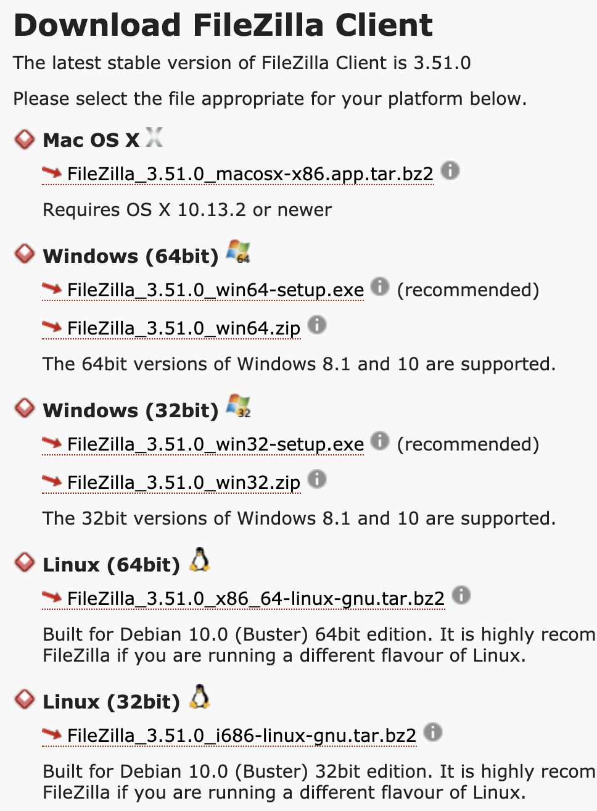

# 컴파일러

## CPU에 일 시키기

CPU에게 일을 시키기 위해서는 CPU가 이해할 수 있는 `0001 0000 0100 0111` 이런 명령어를 입력해야 한다. 하지만 매우 간단한 프로그램이라면 모를까 WO*, LO* 같은 게임부터 포토*, 웹 브라우저같은 방대하고 화려한 프로그램에는 수 억, 수 십억개의 명령어가 필요한데 어느 누가 `0001 0000 0100 0111` 이런 명령어를 수 억개나 쓰고 싶겠는가. 이렇게 컴퓨터에게 일을 **쉽게** 시키기 위해서는 인간의 언어와 가까운, 최소한 인간이 이해할 수 있는 프로그래밍 방식이 필요했고 이에 발맞춰 프로그래밍 언어가 생겼다.

필요성이 명확했기에 프로그래밍 언어는 생각보다 굉장히 초창기부터 등장했다. 수식 계산에 초점을 맞춘 포트란(FORTRAN)이라는 언어는 이미 1950년대 말에 처음으로 탄생했을 정도였다. 초창기 포트란 프로그램은 아래와 같이 생겼다. 아래 예제는 포트란II로 작성된 프로그램으로, 개인적으로 포트란은 잘 모르기 때문에 [위키북스의 예제](https://en.wikibooks.org/wiki/Fortran/Fortran_examples#FORTRAN_II,_IV,_and_77_compilers)를 들고왔다. 

```
C AREA OF A TRIANGLE - HERON'S FORMULA
C INPUT - CARD READER UNIT 5, INTEGER INPUT
C OUTPUT -
C INTEGER VARIABLES START WITH I,J,K,L,M OR N
      READ(5,501) IA,IB,IC
  501 FORMAT(3I5)
      IF(IA.EQ.0 .OR. IB.EQ.0 .OR. IC.EQ.0) STOP 1
      S = (IA + IB + IC) / 2.0
      AREA = SQRT( S * (S - IA) * (S - IB) * (S - IC) )
      WRITE(6,601) IA,IB,IC,AREA
  601 FORMAT(4H A= ,I5,5H  B= ,I5,5H  C= ,I5,8H  AREA= ,F10.2,
     $13H SQUARE UNITS)
      STOP
      END
```

`1001 0000 0101 1111` 혹은 `MOV $1, $2` 이런 명령어보다 훨씬 인간이 이해하기 쉽다. 아니 그럼 이 코드는 CPU가 이해할 수 없을텐데 어떻게 CPU에게 일을 시키나요? 그래서 프로그래밍 언어와 뗄레야 뗄 수 없는 영혼의 단짝을 이루는게 바로 `컴파일러(compiler)`이다. 컴파일러는 여러분의 코드를 CPU가 알아먹을 수 있도록 `1001 0000 0101 1111`같은 명령어의 집합으로 바꿔주는 프로그램이다. 현대의 컴파일러는 C/C++과 같은 프로그래밍 언어를 기계어로 번역해주는 일을 한다고 볼 수 있다. 참고로 CPU가 별도의 컴파일러 없이 알아들을 수 있는 `1001 0000 0101 1111`같은 명령어도 프로그래밍 언어의 범주에 속하고, 이를 기계어(Machine Code)라고 한다. 

파이썬은 컴파일러가 없는데요? 이 얘기는 나중에 설명하고...

## 컴파일러의 구조

최신 컴파일러는 보통 2단계 혹은 3단계로 구성되어 있다. 프론트 엔드(Front end), 미들 엔드(Middle End), 백엔드(Back End)에 대한 내용을 신나게 쓰다가 너무 깊이 들어가는 듯 하여 다 지우고 간단하게만 언급하고 넘어간다. 자세한건 나중에 다시 별도의 장으로 만들어서 설명하면 좋겠다. (희망사항)

프론트엔드는 
- 소스 코드를 단어 별로 잘라서 이 단어가 무엇인지 딱지를 붙이고(Lexical Analysis)
- 구문 트리(Syntax Tree)라는 것을 만든다. (Syntax Analysis)
- 이 구문 트리로 의미를 해석한다. (Semantic Analysis)

이 과정을 통해 문법에 맞지 않는 소스 코드에 에러나 경고를 날리고 에러가 없으면 추상 구문 트리(Abstract Syntax Tree)를 만들어 내서 미들 엔드에 넘긴다.

미들엔드는
- 추상 구문 트리로 중간 표현(IR, Intermediate Representation) 혹은 중간 코드(IC, Intermediate Code)라고 불리는 데이터로 변환한다.
- 이 과정에서 최적화를 실행한다. 안쓰는 코드를 날려버린다거나 절대 실행되지 않을 코드, 루프 연산 최적화 등이 이 과정에서 발생한다.

미들엔드의 최종 결과물은 최적화된 IR이다.

컴파일러의 최적화를 맛보기로 보여주면, 
```cpp
int square(int num, int t) {
    int k = 0;
    if (k == 1) {
        int a = t + 1;
        return a;
    }
    return num * num;
}
```
이런 C++ 코드가 있다. k값이 0이기 때문에 `if (k == 1)` 블럭 안의 문장은 수행되지 않는다. Microsoft의 C++ 컴파일러인 x64용 MSVC 19.27 버전에서 컴파일을 하면 아래의 어셈블리어로 컴파일한다. 참고로 어셈블리어는 기계어와 1:1로 대응되지만 `mov $1, $2`와 같이 사람이 조금 더 보기 편하게 볼 수 있는 프로그래밍언어다.
```
k$ = 0
a$1 = 4
num$ = 32
t$ = 40
int square(int,int) PROC                             ; square
$LN4:
        mov     DWORD PTR [rsp+16], edx
        mov     DWORD PTR [rsp+8], ecx
        sub     rsp, 24
        mov     DWORD PTR k$[rsp], 0
        cmp     DWORD PTR k$[rsp], 1
        jne     SHORT $LN2@square
        mov     eax, DWORD PTR t$[rsp]
        inc     eax
        mov     DWORD PTR a$1[rsp], eax
        mov     eax, DWORD PTR a$1[rsp]
        jmp     SHORT $LN1@square
$LN2@square:
        mov     eax, DWORD PTR num$[rsp]
        imul    eax, DWORD PTR num$[rsp]
$LN1@square:
        add     rsp, 24
        ret     0
int square(int,int) ENDP     
```

뭔진 모르겠지만 뭔가 기계어가 많다. 똑같은 코드 그대로 최적화 옵션을 켜고 (/Ox) 컴파일을 해보면 
```
num$ = 8
t$ = 16
int square(int,int) PROC                             ; square
        imul    ecx, ecx
        mov     eax, ecx
        ret     0
int square(int,int) ENDP                             ; square
```

짜잔~! 변환된 기계어 코드가 극적으로 줄어든 것을 확인할 수 있다. 컴파일러 내부적으로 절대 도달할 수 없는 경로(Unreachable Code)인 `if (k == 1)` 블럭을 통째로 날려버리고 더 나아가 사용하지 않는 코드(Unused Code)인 `int k = 0`도 없애버린걸 알 수 있다.

백엔드는
- 이 최적화된 IR로 대상 아키텍쳐에 최적화된 기계어를 생성한다. 2장 2절에서도 말했듯이 CPU마다 알아듣는 명령어가 다르기 때문에 각 CPU(ARM이라던가 Intel이라던가 ..)에 맞는 기계어를 생성한다. 엄밀하게 말해서는 컴파일러는 목적코드(Object Code)라는 걸 생성하고 링커(Linker)라는 프로그램이 이 목적 코드를 합쳐서 실행 가능한 코드를 만든다.

## 왜 윈도우 프로그램이 MacOS에서 동작하지 않나요?

유명한 오픈소스 프로젝트 중에 [파일질라(File-zilla)](https://filezilla-project.org)라는 FTP 프로그램이 있다. 이 프로그램을 다운로드 받기 위해 [다운로드 페이지](https://filezilla-project.org/download.php?show_all=1)로 가보면 Mac OS X, Windows 64bit, Windows 32bit, Linux 32bit, Linux 64bit 용 다운로드 항목이 다르다.



아니 어차피 다 같은 Intel CPU에서 동작하는데 왜 패키지가 다른가요? 여태까지 배운걸로는 같은 CPU에서 동작하니까 명령어 코드도 같고 리눅스건 윈도우건 나눌 필요가 없지 않나요 물어볼 수 있겠다. 반은 맞고 반은 틀리다.

컴퓨터는 CPU만 있는게 아니다. 물론 CPU없는 컴퓨터는 뇌 없는 인간과 같지만 인간은 뇌만으로 이뤄진건 아니고 눈, 코, 입, 귀, 다리, 팔, 내장이 조화를 이뤄야 진정한 인간이 된다. 컴퓨터는 모니터도 있어야되고 SSD도 있어야 되고 키보드, 마우스, 그래픽카드, 무선랜카드 등등이 있어야 비로소 컴퓨터가 된다. 이런 주변기기들을 제어해야 하는데 하나의 프로그램에서 수 많은 무선랜 카드를 제어하는 프로그램을 넣고 수 많은 키보드를 제어하는 프로그램을 넣는건 불가능하다. 이 때문에 운영체제(Operating System)가 존재하는 이유다. 운영체제는 프로그램을 대신해서 주변장치를 제어할 수 있도록 해준다. 프로그램은 운영체제에 그저 시스템 콜(System Call)이라는 특별한 명령어를 보내면 주변 기기를 제어할 수 있다. 

문제는 시스템 콜이 **운영체제 마다** 다르다. 제목대로 윈도우의 시스템 콜은 Mac OS의 시스템 콜과 **매우 다르다**. 따라서 윈도우 프로그램은 Mac에서 동작하지 않는다. (Executable Format이 다르기도 하지만...) 그렇기 때문에 모든 프로그램은 파일질라 다운로드 페이지처럼 특정 CPU와 더불어 특정 운영체제용으로 컴파일해서 배포된다.

## 스크립트 언어

모든 프로그래밍 언어가 컴파일이 필요한 건 아니다. 이른바 `스크립트 언어`라 불리는 프로그래밍 언어는 컴파일 없이 바로 실행이 가능하다. 대표적인 언어로는 자바스크립트, 파이썬, PHP 등이 있다. 허나 OS와 스크립트 언어 사이에서 누군가는 소스코드를 기계어로 바꿔줘야 실행이 가능한데, 그 '누군가'가 바로 `인터프리터(interpreter)`라고 불리는 프로그램이다.

컴파일된 코드는 마치 사전에 번역한 문서와 같다면 인터프리터는 마치 통역가와 같은 존재다. 한쿡인이 독일인에게 자신의 의사를 전달하려 할때 통역가는 한국인이 말 할때마다 독일어로 바꿔서 말해준다. 인터프리터도 다르지 않다. 컴파일된 코드는 이미 CPU/OS에 맞게 모두 번역되어 있는 상태, 즉 컴파일 결과로 목적 플랫폼에 맞는 기계어로 만들어져 있어서 CPU에서 바로 실행할 수 있지만 스크립트 언어는 실행 시점에 해당 CPU/OS에서 해석 가능한 코드로 번역하기 때문이다. 

컴파일이 필요한 언어와 스크립트 언어는 각각 장단점이 굉장히 뚜렷하다. 스크립트 언어는 반드시 동작시킬 플랫폼에 맞는 인터프리터가 필요하지만, 컴파일이 필요한 언어는 그렇지 않다. 반면 스크립트 언어는 컴파일된 코드에 비해 매우매우 느리다. 이를 뒤집어 보면 스크립트 언어는 컴파일이 필요없지만 컴파일이 필요한 코드는 반드시 컴파일 과정을 거쳐야하는데, 규모가 크면 클 수록 컴파일에 걸리는 시간(보통 컴파일 시간 혹은 컴파일 타임이라고 한다)이 무시못할 정도로 커진다. 간단한 작업의 경우에는 스크립트 언어가 훨씬 강점이 많다.

## JIT(Just-in-time) 컴파일러

앞서 설명한 대로 컴퓨터에게 일을 시키기 위해서는 미리 코드를 컴파일 해놓거나 인터프리터를 이용해서 실행 중 그때그때 기계어 코드를 생성해서 실행하는 방법이 있다. JIT 컴파일러는 이 두 가지 방식을 섞어놓은 방식이라고 생각하면 된다.

이 JIT 컴파일러를 사용하는 대표적인 언어인 자바를 예시로 들면서 설명하겠다. 내가 만든 짱 멋진 스프링으로 만든 웹서버를 리눅스 서버에 올려서 서비스를 한다고 가정해보겠다. 맥OS용 인텔리J에서 열심히 코드를 짜서 빌드를 하면 내부적으로 `javac`라는 컴파일러가 자바 코드를 `바이트코드(Bytecode)`라는 코드로 변환한다. 

이를 리눅스 서버로 올려서 실행하면 해당 바이트 코드는 리눅스용 `JVM(Java Virtual Machine)`에서 읽어서, 필요할 때마다 바이트코드를 `JIT 컴파일러`에서 리눅스에 맞는 기계어 코드로 변환해서 실행한다. Just-in-time은 그때그때마다 적기적소라는 의미를 담고 있다.

```아니 그럼 인터프리터를 쓰는 스크립트 언어와 뭐가 달라요?```

굉장히 좋은 딥 태클이다. 크게 보자면 다른건 없는데 자세히 보면 다르다. 일단 다른 스크립트 언어보다 **훨씬** 빠르다. 그 이유는 바로 `바이트코드`에 있다. 

앞서 최신 컴파일러는 프론트엔드 - 미들엔드 - 백엔드로 구성되어 있다는 점을 설명했다. 자바의 전략도 이와 유사하다. `javac`를 통해 바이트코드로 컴파일하는 단계는 컴파일러의 프론트엔드 - 미들엔드와 같다. 바이트코드로 변환하는 단계에서 코드 최적화가 수행되기 때문이다. 이 바이트코드는 컴파일러 미들엔드의 산출물인 `중간 표현(IR)`과 일면 동일하다고 볼 수 있다. 반면 일반적인 스크립트 언어는 미들엔드에서 수행하는 최적화 과정이 없다. 

이것만으로는 자바가 다른 스크립트 언어보다 훨씬 빠르다는 점을 뒷받침하기엔 좀 약한데, 이 부분은 바이트코드와 JVM안에 내장된 JIT 컴파일러의 활약으로 커버할 수 있다. 먼저 바이트코드는 기계어로 빠르게 변환을 목적으로 설계되었기 때문에 기계어로 컴파일이 빠르며, 이 바이트코드를 기계어로 컴파일하는 `JIT 컴파일러`의 캐싱 전략 때문에 한층 더 빠르다. 자주 사용하는 물건을 가까이 놓는 것처럼 자주 사용하는 기계어를 캐시에 저장해서 바이트코드를 기계어로 컴파일 하는 횟수를 줄이기 때문이다.

## 컴파일러의 종류

위에서 소스 코드를 실행 가능한 기계어로 번역해주는 일을 하는게 컴파일러라고 썼지만, 사실 컴파일러의 범주는 꽤나 넓다. 타입스크립트를 자바스크립트로 바꿔주는 `tsc`도 넓게보면 컴파일러로 분류할 수 있으며 자바나 파이썬처럼 바이트코드로 만들어주는 프로그램도 컴파일러다. 또한 JIT 컴파일러 역시 컴파일러의 일종이다.

## 마치며

과거 소스 코드의 문제점을 실행해보지 않고 검사해주는 정적코드 분석기(Static Code Analysis)를 만들었던 적이 있어서 컴파일러 이야기가 매우 반가웠다. 하지만 신나게 적다보면 독자들이 이해하기 힘들 수 있으니 처음부터 마음을 다잡고 굉장히 기초적인 내용만 적었다. 컴파일러는 보통 컴퓨터공학 3~4학년이 수강하는 과목이다. 그 말인 즉슨 1~3학년때 배운 수학, 컴퓨터구조, 자료구조, 알고리즘, 운영체제, 프로그래밍 언어론 등등의 모든 컴퓨터 공학을 집대성한 분야이기 때문에 내용도 상당히 심오하고 구현은 상당히 어렵다. 나중에 별도의 장(chapter)에서 다룰 수 있기를 바란다!

## 후원안내

사용자 경험을 위해 광고는 달지 않습니다. 만약 글이 읽을만한 가치가 있고 다음 편을 위해 응원을 해주시고 싶으시다면 아래 카카오페이로 QR코드로 커피값 1,000원(더 주셔도 됩니다...) 후원 부탁드리겠습니다.


방법은 카카오톡 더보기 메뉴(우측 하단 ... 버튼) - 카카오 페이 - 결제 화면 상단의 QR 버튼을 누르시면 됩니다.
