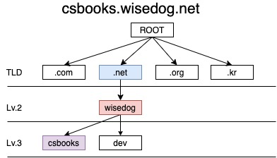
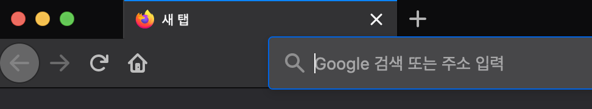
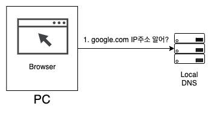
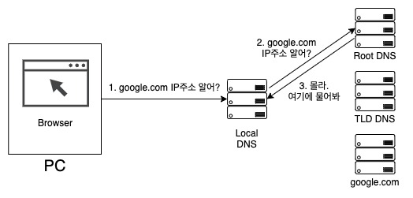
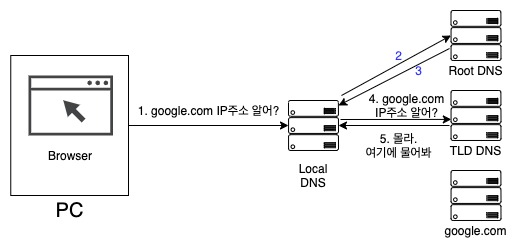
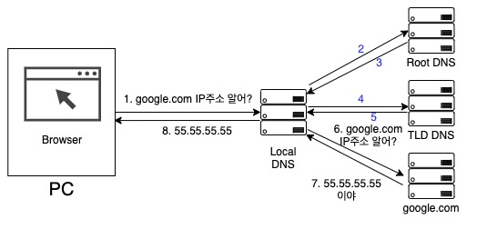
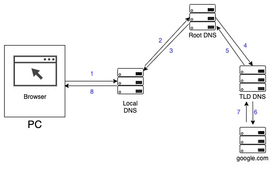

# DNS

IP는 IP주소로 목적지를 찾아가는 프로토콜이다. 그럼 `csbooks.wisedog.net`에 데이터를 요청하는 패킷을 싣어 보낼때, IP주소를 어떻게 알 수 있을까? 해답은 바로 DNS(Domain Name System)다. 여러분은 옆 자리에 앉은 동료의 핸드폰 번호를 기억하는가? 아마 높은 확률로 기억 못할 것이다. 기억하지 못한다고 통화를 할 방법이 없지 않다. 스마트폰 주소록 앱에서 "옆자리 망할 놈"이라고 저장된 이름을 찾아서 전화 버튼을 누르면 통화할 수 있기 때문에 일상 생활에 별 지장이 없다. DNS도 마찬가지로 사람이 인식/기억하기 쉬운 정보인 google.com 같은 도메인 이름의 IP주소가 뭐냐는 문의가 들어오면 이에 맞는 IP주소로 바꿔주는 일종의 테이블과 같다고 생각하면 쉽다.

## 도메인 이름(Domain Name)

여러분은 naver.com의 IP주소를 아는가? daum.net의 IP주소는? 1초내로 답이 튀어나오는 사람은 해당 기업 네트워크 담당자다. 그 외에는 아무도 모른다. 하지만 여러분은 네이버나 다음을 이용하는데 불편함을 느낀 적이 없을 것이다. 축하한다. 여러분들은 자신도 모르게 `도메인 이름`이라는 기술을 체득한 셈이다.

그렇지만 우리는 이론을 알아야 하는 사람들이기 때문에 좀 더 도메인에 대해서 알아보자. 도메인 이름은 사용자가 쉽게 기억할 수 있도록 문자열과 숫자로 구성되어 있으며, 인터넷 상에서는 유일무이한 존재이다. 이 도메인 이름은 규칙이 있어서 아무렇게나 만들수 없다. `csbooks.wisedog.net`이라는 도메인 이름을 예로 들어보자. 

도메인 이름은 끝에서부터 TLD(Top-Level Domain), SLD(Second-Level Domain, 레벨2 도메인), Third-Level Domain(레벨3 도메인)으로 구성되어 있다. ROOT라는 도메인 아래에 트리를 거꾸로 세워놓은 듯이 구성되어 있다. 위 도메인을 예로 들자면 아래와 같다. 

`csbooks.wisedog.net`의 경우 ROOT 아래 TLD는 `.net`, 2단계는 `wisedog`, 3단계는 `csbooks`가 된다. TLD는 크게 2종류나 3종류로 구분할 수 있다. 크게 2종류로 구분한다면 아래와 같이 구분한다.

- 일반최상위도메인(gTLD: Generic Top Level Domain)
- 국가최상위도메인(ccTLD: Country Code Top Level Domain)

gTLD는 스폰서도메인(sTLD: Sponsored TLD)과 언스폰서도메인(uTLD: Unsponsored TLD)으로 구분된다. 스폰서 도메인은 `.edu`, `.gov`와 같은 도메인으로 전체 리스트는 [위키피디아](https://en.wikipedia.org/wiki/Sponsored_top-level_domain)를 참조하도록 한다. 그 외에는 모두 언스폰서 도메인이다.

일반 최상위 도메인은 `.net`, `.com`과 같은 도메인이고 국가최상위도메인은 국가를 나타내는 ISO 3166-1 Alpha-2 표준에 의거 2자리 영문 알파벳인 부호다. `.kr`, `.jp` 등이 이것이다. 다만 영국만 예외적인데, 영국의 ISO 3166-1 표기는 `GB`지만 ccTLD 부호는 `uk`를 쓴다. 이 국가도메인은 각 국가 기관들이 관리하고 있다.

여러분들은 `.co.kr`으로 끝나는 많은 사이트를 방문한 적이 있을텐데, 재미있는 사실은 (없을 수도 있다) `kr`이 TLD, 2단계는 `.co`, 3단계가 사이트 이름이다. 예를 들어 이 학교 출신은 아니지만 제주도 가고싶다는 열망을 담은 제주국립대학교를 예로 들면 도메인이 `jejunu.ac.kr`인데, `kr`이 ccTLD, `ac`가 2단계 도메인, `jejunu`가 3단계 도메인이 된다.

도메인은 도매인 등록 대행 업체에서 `이용권리`를 살 수 있다. 도메인 자체를 사는게 아니라 일정 기간 임대비용이라 생각해야 한다.

## 여러분이 google.com을 칠 때

자, 그럼 여러분이 웹 브라우져 검색창에 `google.com`을 쳤을때, 벌어지는 일을 살펴보면서 DNS가 어떻게 우리의 인터넷 삶에 관여하고 있는지 살펴보자.

사용자가 웹 브라우저에 `google.com`을 치고 엔터를 누르면 먼저 브라우저의 DNS에 `google.com`의 IP 주소를 물어본다. 최신 브라우저는 일정 시간 동안 DNS 정보를 캐시하기 때문에 최근에 google.com을 방문했다면 IP주소를 가지고 있다. 만약 브라우저 DNS에서 google.com의 주소를 찾지 못한다면 운영체제(OS)의 DNS에 google.com의 IP 주소를 물어본다.

여기서도 찾지 못한다면 근거리 네트워크 혹은 ISP 내에 있는 로컬 DNS라 불리는 DNS가 출동할 차례다. 로컬DNS가 google.com의 IP주소를 찾는 방법에는 2가지가 있다. 하나는 반복적 질의(iterated query)라는 방식이고, 또 다른 하나는 재귀적 질의(recursive query)라는 방식이다.

먼저 반복적 질의를 알아보자.

로컬DNS에서 google.com의 IP 정보를 찾지 못하면, 로컬 DNS의 주도하에 google.com의 IP를 찾기위해 드넓은 인터넷에 google.com의 IP주소를 물어보기 시작한다. 로컬 DNS가 맨 먼저 google.com의 IP주소를 물어볼 대상은 `루트 네임서버`이다. 루트 네임서버는 비영리 단체인 ICANN이 관리하는 시스템이며 2016년 기준으로 전 세계에 632개의 인스턴스에서 수 많은 요청을 처리하고 있다. google.com 같은 유명 도메인의 경우에는 DNS 루트 네임서버가 그 정보를 가지고 있어서 즉각 사용자에게 전달해주겠지만, 일단 그렇지 않다고 가정해보자. 

이 경우 루트 네임서버는 최상위 도메인 DNS 서버의 주소를 알려준다. 난 모르니까 여기에서 물어봐 - 이런거다. 로컬DNS가 요청한 주소가 google.com 니까 최상위 도메인은 .com이며 응답으로 .com TLD 네임서버의 주소를 알려준다. 로컬DNS는 이 주소에 대고 다시 google.com의 주소를 물어본다.

만약 TLD 네임서버도 google.com 의 주소를 모른다고 한다면, TLD 네임서버는 google.com의 네임서버 주소를 알려주면서 여기에 물어보라고 한다. google.com의 네임서버 주소라니, 그냥 google.com 주소 아닌가요? 할 수도 있겠지만, 응 아니다. 예를 하나 들자면 여러분이 가XX에서 도메인 주소를 신청했다면 도메인의 네임서버를 반드시 설정하게 되어있다. 보통 ns1.gabxxx.com 이런식으로 되어있는데, 이 ns1.gaxxx.com 라는 주소를 응답해준다.

아무튼 TLD 네임서버에서 나는 모르니까 여기에 물어봐라고 준 google.com의 네임서버 주소에 질의를 하면 이제 google.com의 IP주소를 응답해준다. 로컬DNS는 이렇게 어렵게 획득한 IP 주소를 브라우저에 전해주고, 브라우저는 이 IP로 HTTP 요청을 통해 웹페이지를 요청한다.

재귀적 질의는 반복적 질의와 약간 다른데 주인공이 로컬DNS가 아니라 루트 네임서버다. 루트 네임서버가 주소를 모르면 TLD 네임서버에 물어보고, TLD 네임서버도 모르면 google.com 네임서버 주소에 IP를 물어보고 로컬 DNS에 결과를 알려준다..

## TTL - Time To Live

네트워크를 다루다보면 반드시 알아야할 내용 중 하나가 TTL이다. 아까 예를 든 google.com의 IP주소를 예로 들자면, 만약 어떤 네임서버가 google.com 의 IP주소를 반환하는데 성공했다면, 이 정보를 일정시간 캐시해둔다. TTL은 이 캐시에 저장되는 시간을 의미한다. 네임서버의 캐시에 google.com 의 정보가 있다면 네임서버는 캐시에서 꺼내어 바로 google.com의 IP주소를 반환한다.

TTL이 중요한 이유중 하나는, 웹서비스를 하다보면 가끔씩 IP주소를 바꿔야할 일이 생기기 때문이다. 여러분이 asdf.com 이라는 웹서비스를 운영하고 있는데 이번에 서비스하는 IP주소를 11.11.11.11에서 22.22.22.22로 바꿔야한다고 가정하자. DNS에 대한 이해가 없이 그냥 바꾸면 큰 문제가 생긴다. asdf.com 도메인의 TTL을 1시간으로 잡아놨는데, IP주소를 22.22.22.22로 바꾸고 11.11.11.11 IP를 가진 웹서버를 꺼버렸다고 가정하자. 그 시간 사용자들은 브라우저에 asdf.com를 치고 엔터키를 누르면 DNS에 IP주소를 물어보는데, 네임서버는 이미 기존에 캐싱한 11.11.11.11 을 반환한다. 그럼 웹브라우저는 11.11.11.11 에 데이터를 요청하는데, 아뿔싸! 11.11.11.11는 아무것도 없다.

만약 IP를 변경해야 한다면, 기존 웹서버는 당분간 그대로 살려놓은 후, TTL을 5분으로 설정하고 IP를 바꾼 후 다시 TTL을 늘려잡는게 좋다. 