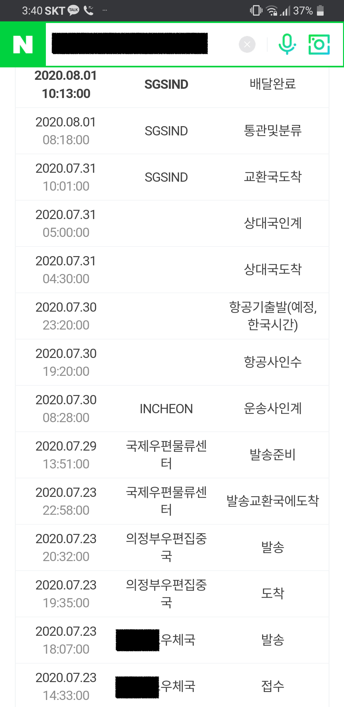
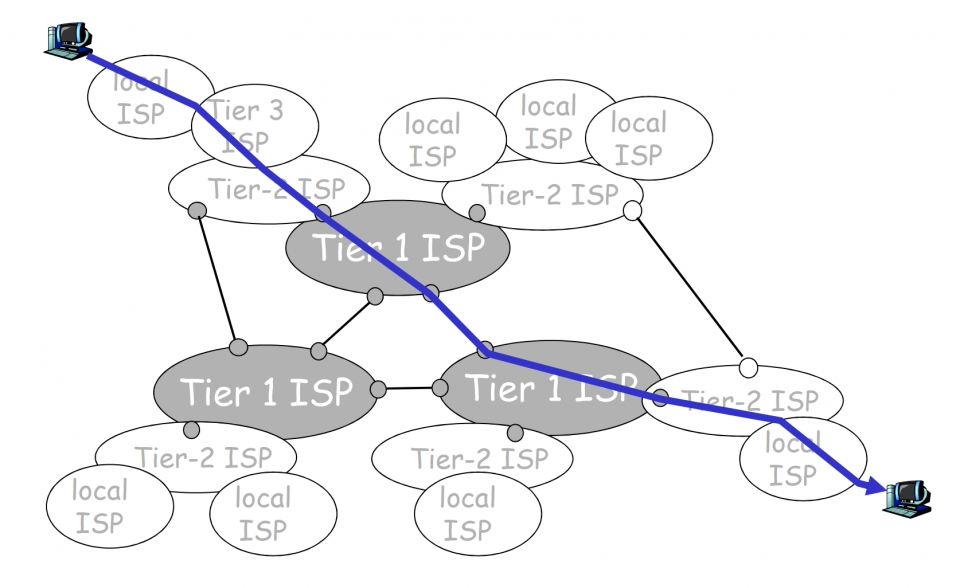

# 네트워크란?

`네트워크(network)`는 보통 상호 간의 소통과 연결 하는 통로를 지칭할때 사용한다. 방송 네트워크도 네트워크도 사람들 간의 모임도 네트워크의 일종이다. 컴퓨터 과학에서의 네트워크도 동일한 용어로 사용된다. 컴퓨터끼리 연결되어 상호간에 데이터를 주고 받는, 즉 통신을 하는 시스템을 컴퓨터 과학에서도 네트워크 혹은 `컴퓨터 네트워크`라고 지칭한다. 앞으로 `네트워크`라고 하면 기본적으로 `컴퓨터 네트워크`를 칭한다.

이렇게 정의를 내리니까 네트워크라는게 뭔가 위대하고 거창하고 대단해보인다. 물론 그렇긴 하지만 미리 겁먹을 필요는 없다. 네트워크는 이미 일상 곳곳에 녹아있다.

출퇴근 시에 사람들이 무선 이어폰으로 음악을 듣는 행위도 스마트폰과 무선 이어폰이 네트워크를 이루고 있기에 가능한 일이다. 이 네트워크에는 단 2대의 기기가 연결되어 있는 셈이다. 좀 더 큰 네트워크도 있다. 가정에서 사용하는 인터넷 공유기가 좋은 예이다. 요즘 시대에는 혼자 살아도 스마트폰, 노트북, OO도 스위O, 태블릿 등등 여러 대의 기기가 인터넷 공유기에 접속해있다. 이것도 네트워크다. 하지만 공유기만 있고 인터넷 가입을 하지 않았다면 공유기를 통해 까또크도 쓸 수 없고 웹으로 뉴스도 볼 수 없다. 즉 우리가 `인터넷`이라 부르는 더 큰 네트워크와의 접속이 필요하다.

# 인터넷

이미 생활에 녹아든 단어지만 정확한 실체를 모르는 단어 중 하나가 인터넷이다. 인터넷은 사이, 중간을 뜻하는 영어 단어 `inter`와 `네트워크`의 합성어이다. 크리스토퍼 놀란 감독의 인터스텔라(Interstellar) 역시 `inter`와 라틴어로 별을 뜻하는 `stellar`의 합성어로 `별과 별 사이`라는 뜻이다. 즉 인터넷은 여러 조직이 다루는 각각의 네트워크와 네트워크가 모종의 규약으로 묶여 있여있는 큰 네트워크라고 이해하면 된다. 참고로 그 조직의 네트워크를 `AS(Autonomous System)`이라고 한다. KT, LG U+, SK 브로드밴드처럼 인터넷 서비스를 제공하는 `ISP(Internet Service Provider, 인터넷 서비스 제공자)`, 구글이나 AWS같은 대규모 클라우드 운영자 등이 대표적인 AS의 예로 들 수 있다. 

## 운영 주체

네트워크 집합체인 인터넷은 사실 명확한 운영 주체가 없다. 그렇지만 각 네트워크 사이의 자원 배분 및 사용 규칙이나, 표준 기술 제정 등이 필요하기 때문에 굳이 따지면 `ICANN(The Internet Corporation for Assinged Names and Numbers)`과 `IETF(The Internet Engineering Task Force)`를 들 수 있다. 도메인 이름(예: google.com)과 IP주소(예: 233.15.22.55) 같은 자원은 중복되어서는 안되기 때문에 ICANN에서 관리한다. 자원 관리가 중점인 ICANN과는 달리 IETF는 인터넷의 기술을 담당한다. IETF는 다양한 인터넷 기술 RFC(Request For Comments)라 불리는 일련의 기술문서를 발행하며 각종 인터넷 표준기술을 제정하는 역할을 한다.

## 미국으로 데이터 보내기(간략 버전)

처형이 싱가폴에 살고 있다. 아내가 가끔씩 처형에게 우체국EMS를 통해 과자나 옷과 같은 물건을 보내준다. 우체국EMS도 국내 택배 배송 추적처럼 진행 상황을 볼 수 있다.

이 추적 경로를 보니 택배건 EMS건 전 세계 네트워크건 동작 방식이 크게 다르지 않다는 사실을 깨달았다. 현재 남양주 모처에서 살고있는데 이곳 지역 우체국에서 보낼 우편물을 맡기면 지역 우체국에서는 우편물을 모아서 트럭으로 `우편집중국`이라는 곳으로 우편물을 보낸다. 이 곳 우체국EMS는 아마도 의정부 우편집중국에서 담당하나보다. 의정부 우편집중국에 모인 우편물 중 해외로 나갈 우편물만 모아서 트럭으로 국제물류우편센터로 이동하고, 여기서 화물기를 타고 싱가폴로 간다. 싱가폴에서 어떻게 처형에게 갔는지는 모르지만 아마도 남양주 모처->국제물류우편센터의 역순으로 최종 배송지까지 이동했으리라.

미국의 스미스씨와 서로 통신을 주고받는 행위도 이와 비슷하다. 

뫄뫄씨가 스마트폰으로 스미스씨에게 메시지를 보낸다고 가정하자. 메시지 어플리케이션이 무선 전파(LTE, 5G)를 통해 메시지를 보낸다. 해당 메시지는 스마트폰의 기지국을 통해서 교환국이라는 곳으로 전달된다. 교환국은 여러 기지국에서 오는 메시지를 모아 인터넷망을 통해 인터넷 데이터 센터로 전달한다. 

| 우체국EMS | LTE 네트워크 |
| - | - |
| 동네 우체국 | 기지국 |
| 우편집중국 | 교환국 |
| 국제물류우편센터 | 인터넷 데이터센터 |

미국의 스미스에게 보낸 메시지는 각 통신사 인터넷 데이터센터(국제물류우편센터)를 통해서 한국을 벗어난다. 그 후 우체국EMS에서 비행기로 우편물을 운반하듯이 큰 네트워크 사이를 연결하는 초고속 광케이블을 타고 미국으로 향한다. 이 초고속 광 케이블은 주로 해저에 설치되어 있으며 이런 케이블을 설치하고 관리하는 네트워크 서비스 제공자를 보통 `티어(Tier)1 ISP`라고 한다. 즉, 스미스에게 보내는 메시지는 이 티어1 ISP의 회선을 타고 해외로 나가는 셈이다. 

태평양을 건넌 메시지는 미국의 한 ISP가 받는다. 보통 티어1 ISP에 비용(망사용료라고 한다)을 지불하고 네트워크를 이용하는 ISP를 `티어2 ISP`라고 한다. 참고로 한국의 SK브로드밴드와 KT가 이 티어2 ISP에 해당한다. 그리고 스미스씨는 이 ISP를 통해서 혹은 또 다른 ISP를 통해서 메시지를 받을 수 있다.

    
그림 출처: http://www.jaturi.kr/news/articleView.html?idxno=5405

즉 다시 정리해보면 한국의 뫄뫄씨는 모바일로 미국 스미스에게 메시지를 보내는 상황이다. 뫄뫄씨는 티어3 ISP인 SK, KT, LG U+ 를 통해 메시지를 보낸다. 이들을 티어3 ISP라 하며 트래픽 전량을 티어2 ISP로 부터 사들인다. (근데 한국의 이동통신사들은 자체 유선통신망도 가지고 있어서 같은 티어1,2,3이 같은 회사이지 싶다. 이쪽은 제가 잘 몰라서 아시는 분 설명 부탁드립니다.)

티어2 ISP는 티어1 ISP에게 이용료를 지불하고 이들의 망에 접속한다. 티어2 ISP가 티어1 ISP에 접속되어 있기 때문에 미국에 있는 스미스씨에게 메시지를 보낼 수 있다. 한편 뫄뫄씨가 속초에 사는 친구 모모씨에게 메시지를 보낸다하면 티어1 ISP까지 가지 않고 티어2 ISP끼리 이를 처리할 수도 있다. 티어2 ISP끼리는 서로 연결되어 있기도 하기 때문이다.

매우 간략해보이지면 그 안에서는 굉장한 일이 일어나고 있다. 데이터가 이름표와 목적지를 명찰을 달고 움직이고 버스 환승하듯이 네트워크와 네트워크 사이를 갈아타기도 하고 길이 막히면 돌아가기도 하고 길을 잃고 헤매기도 하고 데이터를 전송하기 위해 서로와 서로 사이에 인사를 나누기도 한다.
