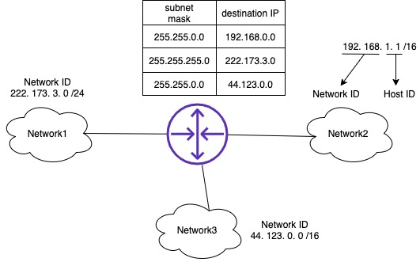

# IP

IP(Internet Protocol)은 TCP/IP 중 IP를 맡고 있는 프로토콜이다. 앞서 설명한 TCP 프로토콜의 역할을 한 마디로 정의하자면 `인터넷 계층에서 오는 데이터를 알맞은 어플리케이션으로 보내는 일`이라면 인터넷 계층에 해당하는 IP의 역할은 양단간 통신 혹은 엔드투엔드 통신이라 불리는 단말(PC, 모바일 등등)와 단말(PC, 모바일 등등) 사이에 전송을 책임진다.

## IP 주소 (IP Address)

택배를 보낼때 내 주소와 상대방의 주소가 필요하듯 IP 역시 자신의 IP주소와 보내는 IP 주소 정보가 반드시 필요하다. IP주소는 총 32비트로 이루어져 있다. 하지만 사람이 `11000000101010000000000000000010` 이런걸 외우기는 커녕 말하기도 힘드니까, 보통 이를 8비트씩 끊어서 표기한다.

이를 도트형 10진 표기(dot-decimal notice 또는 dotted-quad sequence) 라고 한다. 각각 8비트씩 모여서 하나의 숫자를 이뤘기 때문에 이 숫자를 옥텟(Octet)이라고 부르고 8비트로 이뤄진 숫자이기 때문에 2^0 ~ 2^8, 즉 0~255 사이의 숫자를 표현할 수 있다. 따라서 277.111.222.33 같은 IP 주소는 절대 존재할 수 없다. 이 사실을 알았으니 검찰 사칭 보이스피싱이 여러분의 IP를 알고 있다면서 저런 IP 불러주면 여러분은 이제 현명하게 대처할 수 있다.

이 IP주소는 인터넷 세계에서 절대 겹치지 않도록 앞서 말한 ICANN이라는 단체에서 관리하고 있다. 자기 컴퓨터의 IP를 확인해보는 방법은 리눅스/Mac OS라면 콘솔에서 `ifconfig`, 윈도우즈라면 cmd 에서 `ipconfig`를 실행시켜보자.

위는 글쓴이의 Mac의 ifconfig 설정이다. 보통 맥의 경우에는 `en0`를 보면 된다. 나의 IP주소는 192.168.0.2 이다. 어 근데 회사 컴퓨터도 192.168.0.2이고 친구 컴퓨터도 192.168.0.2인데 IP는 유일무이하다고 하지 않았습니까!?

좋은 질문이다. IP주소는 이용 범위에 따라서 `공인 IP 주소`와 `사설 IP 주소`로 구분할 수 있다. IP주소가 다음 범위에 있다면 사설 IP주소 이다.

- 10.0.0.0 ~ 10.255.255.255
- 172.16.0.0 ~ 172.31.255.255
- 192.168.0.0 ~ 192.168.255.255

사설 IP주소는 보통 인터넷 공유기나 회사 내 네트워크 같은 사설 네트워크에서 사용하는데, 이 사설 IP주소를 사용해서는 인터넷 통신을 할 수 없다. 목적지 주소가 저 IP 대역대에 속한 IP 패킷이 들어오면 보통 ISP들이 그냥 그 패킷을 버려버린다. 따라서 공인 IP가 있어야 인터넷 통신이 가능한데, NAT(Network Address Translation)을 사용하면 사설 IP 주소를 사용하여 통신을 할 수 있다.

참고로 사설 네트워크 내에서만 IP가 중복되지 않으면 되고, 다른 사설 네트워크와는 IP가 겹쳐도 상관없다. 옆집 IP Time 인터넷 공유기에 접속한 핸드폰도 아마 192.168.0.1 혹은 192.168.0.2 일테니까. 한 아파트 단지를 탈탈 털면 192.168.0.1이 몇 백명은 나올 것이다. 이런 일은 없겠지만 혹시라도 검찰을 사칭하는 보이스 피싱이 범죄에 연루된 IP를 조사하니 여러분이 썼던 192.168.x.x가 나왔다고, 빨리 돈을 입금시키라고 겁주면 한껏 비웃어주도록 하자.

만약 인터넷 공유기를 사용하지 않았다면 사설 IP가 아닌 공인 IP를 확인할 수 있다.

  백엔드/DevOps 개발자는 Kubernetes, 줄여서 k8s 라는 컨테이너 오케스트레이션시 사용하는 도구를 만질 일이 있을 수 있다. k8s 안에서 Pod라는 단위가 있는데 Pod도 IP를 할당받아서 서로 통신을 주고받는다. 그런데 할당된 주소는 보통 10.OOO.OOO.OOO로 시작한다. 즉! 이 IP로 직접적으로 인터넷이랑 통신할 수 없다. 외부와의 통신은 Ingress라는 서비스를 통해서 할 수 있다. 

## IP 주소 체계

서울특별시 마포구 상암동 일대에는 많은 미디어 업체가 자리를 잡고 있다. MBC, YTN, TVN, JTBC 등이 대표적이다. 그래서 TVN 드라마를 보면 차 내부 씬은 열이면 다섯 이상은 월드컵북로를 배경으로 하고 있다. 옛 생각을 떠오르다보니 말이 이상한데에 샜는데, 월드컵북로에 '누리꿈스퀘어'라는 빌딩이 있다. 상암MBC 바로 앞에 있는 빌딩인데, 특이한건 여기 택배 시스템이었다. 이 빌딩을 목적지로 하는 (거의) 모든 택배는 배송 기사가 최종 수령인인 개인에게 직접 전달하지 않고 지하에 있는 택배 보관소에 운송되며 최종 수령인은 택배 보관소로 가서 택배를 찾아간다.

예를 맡게 든지 모르겠지만 IP주소도 이와 비슷하다. IP주소는 단순히 32비트로 이루어진 숫자로 보이지만 내부적으로는 좀 더 효율적으로 네트워크를 찾기 위해 네트워크ID와 호스트ID라는 두 개의 부분으로 구성되어 있다. 네트워크ID는 '서울특별시 마포구 상암동 월드컵북로 396 누리꿈스퀘어'가 되며 '7층 멋진컴파니 OO사업부'는 호스트ID가 된다. 택배기사는 네트워크 ID만 확인하고 누리꿈스퀘어 지하로 택배배송을 해주고 그냥 가버린다. 네트워크 세상에서의 택배기사는 라우터라는 장비인데, 이 장비도 네트워크 ID로 각 네트워크를 식별한다.

주소처럼 IP주소의 전반부가 네트워크ID이며 후반부가 호스트ID이다. 그럼 전반부와 후반부를 나누는 경계선은 어디인가? 앞 12비트 입니다. 라고 말하고 싶지만, 네트워크ID와 호스트ID의 경계선은 고정되어 있지 않고 유동적이다. 이 경계선은 `서브넷 마스크`라는 값에 의해서 결정된다. 이렇게 유동적인 이유는 `IP주소를 효율적으로 사용하기 위해서`다.

컴퓨터 공학에서 특정 자리의 숫자 값만 뽑아내고 싶을때 쓰는 기법을 마스킹이라고 한다. 이름은 거창한데 숫자에 다른 숫자를 그냥 AND 한 것 뿐이다. 1장에서 AND 연산에 대해서 배운 적 있다. 입력되는 두 수가 모두 1일 때만 1을 출력하는데, 마스킹은 이를 자릿수 레벨에서 수행한다.

예를 들어 255라는 십진수는 이진수로 1111 1111 인데 이를 192라는 이진수 1100 0000과 AND 연산을 하면

앞 2자리의 1은 피연산자 2개가 모두 1이기 때문에 결과가 1, 그 외에는 하나만 1이기 때문에 결과가 0이 나온다. 즉 그 결과는 192가 나온다. 서브넷 마스크의 사용 방법도 이와 동일하다. 서브넷 마스크 역시 IP주소와 동일하게 32비트로 되어 있는데, 네트워크 ID와 호스트ID의 경계선이 16자리라면 서브넷 마스크는 `1111 1111 1111 1111 0000 0000 0000 0000`, 네트워크ID와 호스트ID의 경계선이 8자리라면 서브넷마스크는 `1111 1111 0000 0000 0000 0000 0000 0000`이 된다.

서브넷 마스크도 IP와 같은 이유로 도트형 10진 표기를 사용한다. `1111 1111 1111 1111 0000 0000 0000 0000` 의 경우에는 `255.255.0.0`이 된다. 이 방법 외에도 `프리픽스 표기`라고 하는 방법도 많이 쓰는데, 서브넷 마스크가 반드시 1이 연속된다는 법칙에 착안하여 `/`뒤에 연속된 1의 갯수를 적는 경우가 있다. `IP 주소/숫자`로 표기하는데 만약 192.168.0.2 IP의 서브넷이 `255.255.255.0`이라면 `192.168.0.2/24`로 표기한다.

예를 들어 192.168.1.1/16 이라면 네트워크 ID는 192.168.0.0 이 된다.

이렇게 구해진 네트워크 ID는 라우터에서 사용한다. 앞서 라우터와 라우팅에 대해서 짧게 설명한 적이 있다. 라우터는 라우팅 테이블이라는 정보를 이용해서 IP패킷을 전달하는데, 여기서 라우터가 네트워크를 구분할때 쓰는 정보가 네트워크ID와 서브넷이다.

예를 들어 Network2의 한 호스트가 목적지 222.173.3.111에게 패킷을 전송하고 싶다면, 라우터는 라우팅 테이블을 비교해서 222.173.3.111에 마스크 255.255.255.0를 씌운 222.173.3.0의 호스트에게 보낸다는 사실을 알고 IP패킷을 222.173.3.0/24 네트워크로 보낸다.

더 상세한 라우팅 방법은 별도의 장에서 설명하도록 할 예정이다.

## 유니캐스트와 브로드캐스트

모든 업무용 커뮤니케이션 도구(슬랙, 잔디 등)에서 대화 방법은 크게보면 1:1 대화와 여러 명이 참여하는 대화 방식이 있다. 특히 여러 명이 참여하는 대화방에서 멘션 기능을 잘못쓰면 대화방에 참여한 사람에게 알람이 간다. 

IP통신도 이런 방식이 있는데, 1:1 대화처럼 지정한 통신상대와 대화하고 싶을때를 유니캐스트라고 한다. 대부분의 TCP/IP 통신은 이런 유니캐스트 방식이다. 하지만 몇몇 통신은 1:1보다는 전체 공지 방식이 좋을 수 있다. 가장 좋은 예가 ARP(Address Resolution Protocol)라는 프로토콜이다. ARP을 잠시 설명하자면 얘기가 또 삼천포로 빠질 수 있는데.... 

IP는 목적지 IP주소만 알면 되지만, IP패킷을 실어 나를 이더넷 프로토콜에서는 상대방의 MAC주소라는 걸 알아야한다. 여러분이 사용하는 네트워크 어댑터(흔히 말하는 랜카드)는 고유의 ID가 있는데 이를 MAC주소라고 한다. 문젠 내가 123.123.123.123에 뭔가 데이터를 보내고 싶은데 123.123.123.123의 MAC주소를 어찌 알겠는가? 이럴때 사용하는게 ARP인데 `이 IP의 MAC주소 아세요?`라고 같은 네트워크에 물어볼 때 사용하는 프로토콜이다. 근데 어느 세월에 한 네트워크에 속한 호스트 하나하나 붙잡고 물어보겠는가. 막말로 한 네트워크에 속한 호스트의 수가 10만 개라면 어느 세월에 끝날지 알 수가 없다. 한 사람 한 사람 붙잡고 물어보는 방식이 유니캐스트라면 전체 공지 방송은 브로드캐스트 방식이다.

이 브로드캐스트는 네트워크ID 말고 호스트ID 부분을 모두 1로 채운 주소로 데이터를 전송하면 같은 네트워크 안에 있는 호스트들이 모두 수신 가능하다. 앞서 설명했단 IP 192.168.1.1/16 을 가정하자면 네트워크 ID는 192.168 부분이며 호스트 ID는 1.1 이 된다. 이 호스트 ID를 모두 1로 바꾸면 255.255가 되기 때문에 192.168.255.255로 데이터를 보내면 같은 네트워크 내의 모든 호스트는 192.168.1.1이 보낸 데이터를 수신한다.