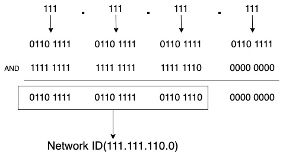

### IP 클래스

여태까지 이상한 예를 들어가며 열심히 서브넷마스크를 설명한 이유는 바로 IP 클래스 때문이다. IP 클래스는 A, B, C, D, E 로 나눌 수 있는데 이를 나누는 기준이 바로 `서브넷 마스크`이다.

A클래스의 경우 네트워크 ID는 첫 8비트이며 이를 구분해내기 위해 필요한 서브넷 마스크는 `1111 1111 0000 0000 0000 0000 0000 0000` - `255.0.0.0`이 된다. 프리픽스 표기로는 `IP/8`이다. A 클래스로 구분할 수 있는 네트워크 수는 2^8인 128개이며 이 네트워크 내에서 IP를 할당해줄 수 있는 기기(호스트)의 수는 2^24 - 2 개인 16,777,214개이다. 왜 2개를 빼냐면 어떤 네트워크에서 호스트ID가 0과 전부 1인 값은 특별한 용도로 사용하기 때문이다. 0으로 채우면 네트워크 자체를 식별하기 위해 이용하는 네트워크 주소가 되며 모두 1을 체우면 전 챕터에 언급한 브로드캐스트 주소 값이라서 일반 호스트에는 할당될 수 없는 IP이기 때문이다.

아래는 각 클래스별 서브넷 마스크, 할당 가능한 네트워크 수와 최대 호스트 수다.

| Class | 네트워크ID Bit수 | 서브넷마스크 | 할당가능한 네트워크 수 | 최대 호스트 수 |
| - | - | - | - | - |
| A | 8 | 255.0.0.0  | 128 | 16,777,214 (2^24 - 2) |
| B | 16 | 255.255.0.0 | 16,384 | 65,534 (2^16 - 2) | 
| C | 24 | 255.255.255.0 | 2,097,152 | 254 (2^8 - 2) | 

클래스 D는 멀티캐스트라고 해서 앞서 설명한 유니캐스트와 브로드캐스트와는 다른 개념인데, IP대역이 `224.0.00 ~ 239.255.255.255`까지이며 클래스 E도 있으나 특수용도로 사용하기 때문에 이 클래스 D, E는 설명을 생략하도록 하겠다.

이렇게 클래스를 나누는 이유는 `효율적인 IP 자원 배분` 때문이다. 예를 들자면 우리 집 네트워크에 A클래스를 할당해주는 경우를 생각해보자. 우리 집 네트워크는 16,777,214개의 호스트에 IP를 할당할 수 있지만 내가 연결할 수 있는 기기는 많아야 5개 정도에 불과해서 16,777,209개의 주소가 낭비된다. 따라서 클래스 A는 아무나 할당하지 않고 국가 단위의 큰 단체나 기업에게만 할당해준다.

## CIDR

바로 위에서 IP 클래스를 설명했지만, 사실 요즘에는 네트워크를 클래스 단위로 관리하지 않는다. 클래스 단위의 최소단위는 255개가 되는데 만약 255개가 아니라 30개씩 8개로 나누고 싶다면 울며 겨자먹기로 255 * 8 = 2040개의 IP 대역을 할당받아서 240개의 호스트에게 밖에 IP를 할당할 수가 없게 된다. 그래서 더 효율적인 네트워크 관리를 위해서 CIDR(Classless Inter-Domain Routing)라는 기법을 쓴다. 외쿡인들 발음보니 `사이더`와 `사이다` 의 중간 정도로 읽더라.

CIDR는 말 그대로 클래스가 없다(Classless)는 뜻이다. 즉 네트워크 관리의 단위가 클래스 단위가 아니라는 점이 중요하다. 이를 위해서는 서브넷마크스의 역할이 중요한데, 기존에는 클래스 단위로 서브넷마스크가 255.0.0.0(/8), 255.255.0.0(/16), 255.255.255.0(/24) 으로 고정되어 있다면 CIDR은 이 비트가 좀 더 가변적인것이 특징이다.

예를 들어 111.111.111.111/24라면 111.111.111.0 ~ 111.111.111.255 까지 호스트 254개(256 - 2)를 할당할 수 있다. 근데 한 네트워크에 호스트 500개를 할당해야 한다면? 서브넷 마스크를 수정해보자.

111.111.111.111/24는 서브넷마스크가 255.255.255.0(11111111 11111111 11111111 00000000)이다. 여기서 서브넷마스크의 3번째 옥텟에서 숫자 1을 빼보자. 255.255.254.0(11111111 11111111 11111110 00000000)이 된다. 이를 IP 111.111.111.111(01101111 01101111 01101111 01101111)과 AND 연산을 해보면 호스트 ID는 111.111.110.0 이 나온다.

호스트 ID 할당은 총 9자리가 되기 때문에 2^9 -2 해서 총 510개의 호스트를 할당할 수 있다. 표기는 111.111.111.111/23이 되겠다. 같은 방법으로 더 작은 네트워크를 구성할 수도 있다. 단순히 서브넷마크스 값만 변경하면 된다. 아까의 IP 111.111.111.111/24에서 4번째 옥텟의 첫 번째 두 번째 자리를 1로 바꿔보자. 그럼 (11111111 11111111 11111111 11000000)이 되며 서브넷마스크는 255.255.255.192가 된다. 이 네트워크가 할당할 수 있는 IP 대역은 111.111.111.64 ~ 	111.111.111.127 이 되며 총 64개의 호스트에 IP를 할당할 수 있다.

이 CIDR은 상당히 많은 곳에서 사용되는데, 예를 들어 AWS의 RDS의 보안그룹을 보면 인바운드 규칙이라는 부분이 있다.

이 설정은 RDS에 접근 가능한 IP를 제약하는 곳인데 만약 내 IP 111.111.111.111만 접속하게 하고 싶다면 111.111.111.111/32 로 적으면 내 IP에서만 RDS에 접근이 가능하다. 서브넷 마스크가 255.255.255.255이기 때문에 IP대역이 딱 111.111.111.111~111.111.111.111 이기 때문이다. 만약 회사 네트워크에서만 접근 가능하게 하고 싶다면? 일단 회사 네트워크 사양을 봐야겠다. 회사 네트워크의 서브넷마스크가 255.255.255.192라면!? 111.111.111.111/26 이라 적으면 IP가 111.111.111.64 ~ 	111.111.111.127 사이의 호스트에서 접속이 가능하다.

0과 1가지고 계산하기 힘들다면 [온라인 툴](https://www.ipaddressguide.com/cidr)을 사용하면 편하다.
