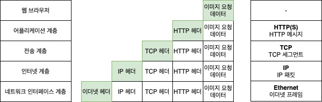

## 프로토콜

사람과 사람이 소통하기 위해서 언어가 존재한다. 한국인은 한국인과 한국어를 사용해서 매우 쉽게 소통할 수 있다. 하지만 한국인과 러시아인은 서로 소통을 못한다. 상호 소통의 규약인 언어가 다르기 때문이다. 네트워크 세상에서는 이를 `프로토콜(Protocol)`이라 부른다. 즉, 네트워크를 구성하는 기기 사이에 미리 약속된 통신 방법과 양식이 프로토콜이다. 허나 하나의 프로토콜만으로는 통신할 수 없기 때문에 콘소시움처럼 여러 프로토콜을 조합해서 사용한다. 이렇게 복수의 프로토콜 집합을 프로토콜 스택(Protocol Stack), 혹은 프로토콜 스위트(Protocol Suite)이라 하는데 한국인과 러시아인이 서로 대화를 나누지 못하듯, 서로 다른 프로토콜 스택끼리는 통신을 할 수 없다.

세상에 여러 네트워크 스택이 있었다. 과거형을 쓴 이유는 현재는 대부분 `TCP/IP`라는 네트워크 스택을 이용하기 때문이다. Microsoft NetBEUI, Apple Appletalk 등이 있었지만 모두 역사의 뒤안길로 사라진 프로토콜 스택이다. 따라서 네트워크 장에서는 TCP/IP만 설명하도록 하겠다.

## TCP/IP 맛보기

사실 `TCP/IP`는 `Internet protocol suite`이라는 이름이 있다. 하지만 `TCP` 프로토콜과 `IP` 프로토콜을 기반으로 하는 프로토콜 스택이기 때문에 보통 `TCP/IP`라고 한다. 아까 복수의 프로토콜을 조합한 것이 프로토콜 스택이라 했다. TCP/IP도 복수의 프로토콜을 조합한 프로토콜 스택으로 여러 계층으로 구성되어 있다.

### TCP/IP 4계층

TCP/IP를 설명할때, 그리고 시험볼 때 빠지지않는 개념이 있는데 `TCP/IP 4계층`이라 불리는 녀석이다. 달달 외울 필요는 없고 굳이 머리속에 넣지 않아도 된다. 다만 이러면 디자인 패턴과 같이 다른 엔지니어와 의사 소통에 문제가 있을 수 있으니 알아두는게 좋다.

TCP/IP의 계층 구조는 아래부터 `네트워크 인터페이스 계층`, `인터넷 계층`, `전송 계층`(혹은 트랜스포트 계층), `어플리케이션 계층`으로 이루어져 있다. 이 4계층의 역할과 각 계층에 속하는 프로토콜을 간략하게 알아보자.

### 네트워크 인터페이스 계층

네트워크 인터페이스 계층은 **물리적으로 데이터를 잘 전송하는 역할**을 맡고 있다. 컴퓨터에서 전송하고자 하는 `010101010101` 데이터는 (한국에서는 흔히 `랜카드`라고 부르는) `네트워크 어댑터` 혹은 `이더넷 카드`라고 하는 장치를 통해 전기신호 등의 물리신호로 변환하여 발송한다.  여기서 사용하는 프로토콜은 우리가 아는 무선랜(Wi-Fi)나 유선랜(이더넷) 등이 이에 속한다.

한 가지 주의해야 할 점은 단순히 내 컴퓨터에서 나가는 랜선 만이 네트워크 인터페이스 계층의 전부가 아니다. 여러분의 집에 있는 인터넷 모뎀, 나중에 `라우팅`에서 배우겠지만 네트워크를 구성하는 스위치라는 기기가 모두 네트워크 인터페이스 계층에 속한다.

### 인터넷 계층

앞서 미국 사는 스미스씨에게 데이터를 보내는 과정을 ISP 티어 1, 2, 3 예를 들어 설명했다. 마치 내가 보낸 데이터는 지하철이나 버스를 갈아타듯이 티어 3 네트워크에서 티어2 네트워크로, 티어 2 네트워크에서 티어 1 네트워크로 갈아타서 최종적으로 미국의 스미스씨에게 도착한다. 인터넷 계층은 이 **네트워크 사이에서 데이터를 잘 전송하는 역할**을 맡고 있다.

인터넷 계층의 핵심장비는 `라우터`란 녀석이다. 라우터는 네트워크와 네트워크를 이어주고 데이터의 최종 목적지에 따라 데이터를 다음 라우터로 전송해주는 역할을 한다. 인터넷 계층에 속하는 프로토콜은 IP, ICMP, ARP/RARP 가 있다.

### 전송 계층

한국사는 뫄뫄씨와 미국사는 스미스씨와의 데이터 전송, 즉 최초 출발지와 최종 목적지 기기 사이의 데이터 전송을 영어로 양단간 통신 혹은 엔드투엔드 통신이라 한다. 전송 계층은 인터넷 계층에서 받은 **데이터를 그 상위 계층으로 전달해주는 역할**과 어플리케이션 계층에서 넘어온 데이터를 **신뢰성 있게 전송을 책임지는 역할**을 맡고 있다.

그 상위 계층은 미리 말해두자면 어플리케이션 계층인데, 여러분이 흔히 생각하는 그 어플리케이션이다. 보통 하나의 OS에서는 여러 개의 어플리케이션을 동시에 동작시키기 때문에 전송 계층에서 이 어플리케이션을 구분할 필요가 있다. 이를 `포트(Port)`라는 논리적인 주소로 구분한다. 마치 데이터를 목적지 아파트까지 배달한건 인터넷 계층, 목적지 아파트에서 원하는 호수로 배달하는건 이 전송계층, 호수는 포트라 생각하면 된다.

대표적인 프로토콜은 `TCP (Transmission Control Protocol)`과 `UDP (User Datagram Protocol)`가 있다.

### 어플리케이션 계층

**휴먼과 직접적으로 상대하는 계층**이다. 브라우져, 아웃룩, 스카이프, 줌, 카카오톡 등 일상 생활에서 사용하는 프로그램이 어플리케이션 계층이다. 대표적인 프로토콜은 HTTP, POP3, SMTP 등이 있다.

정리하자면 아래와 같다.

| 계층 이름 | 설명 | 주요 프로토콜 |
| - | - | - |
| 어플리케이션 | 응용 프로그램에서 데이터를 처리하는 계층  | HTTP, HTTPS, POP3, SMTP, FTP 등 |
| 전송| 어플리케이션에서 넘어온 데이터에 대한 검증, 재전송 등 각종 제어를 담당하는 계층  | TCP, UDP |
| 인터넷 | 데이터를 목적지까지 효율적으로 전달하는 방법을 담당하는 계층 | IP, ICMP 등|
| 네트워크 인터페이스| 실질적으로 데이터를 전송하는 계층 | Ethernet, Wi-Fi 등|

HTTP, POP3처럼 어디선가 들어본 단어도 있고 SMTP, ICMP처럼 처음 처음 들어보는 프로토콜이 있으리라. 지금은 설명을 하지 않고 나중에 다룰 기회가 있으니 이런게 있다고만 알고 넘어가도록 하자.

## TCP/IP을 활용한 데이터 흐름

### 캡슐화와 역캡슐화

앞서 TCP/IP는 4개의 프로토콜이 계층적으로 조합된 프로토콜 스택이라고 말한 바 있다. 데이터 전송의 주체가 되는건 여러분들이 사용하는 카톡같은 어플리케이션이다. 데이터 전송은 대체로 요청과 응답 이렇게 양방향으로 이루어진다. 어플리케이션에서 데이터를 전송할 때는 상위 계층에서 하위 계층으로 데이터가 이동하고 어플리케이션이 데이터를 수신할 때는 데이터가 하위 계층에서 상위 계층으로 이동한다. 상위 계층에서 하위 계층으로 데이터가 이동할 때는 그 계층마다 필요한 정보가 필요하다.

예를 들어 책을 택배로 보내고 싶다면 책을 포장해서 그 위에 자신의 주소와 받을 상대방의 주소를 써넣어야 한다. 그럼 택배사가 이 주소를 보고 배송에 필요한 정보(예: 옥천 버뮤다로 가라)를 택배 상자 위에 붙인다. 이런 추가 정보를 프로토콜에서는 이를 제어 정보 혹은 헤더라고 한다. 헤더는 하위 계층으로 내려갈때마다 추가 되는데, 이렇게 헤더를 추가하는 행위를 `캡슐화`라고 한다. 반대로 상위 계층으로 올라갈 때마다 추가한 헤더를 읽고 알맞은 행동을 취한 후, 헤더를 제거하는데 이를 `역캡슐화`라고 한다.

### 웹 브라우저로 이미지 파일 불러오기

여러분들은 모바일 혹은 노트북(PC)의 웹 브라우져로 지금 이 글을 읽고 있다. 이 글에는 아래와 같이 귀여운 강아지 사진이 있다.

이 멋진 이미지를 읽기 위해서는 여러 절차가 필요하다. 크롬이나 파이어폭스 등의 웹 브라우저는 이 페이지를 구성하고 있는 html 파일을 읽는다. "img" 태그를 만나면 해당 주소에 있는 서버에 이미지를 `요청`한다. 예를 들어 `https://csbooks.wisedog.net/aaa.jpg`라고 하자. 

첫 번째. 먼저 웹 브라우저는 `csbooks.wisedog.net`이라는 곳에 이미지를 `요청`하는 메시지를 만든다.   
두 번째. 웹 브라우저는 이 메시지 앞에 `HTTP 헤더`라고 불리는 정보를 붙인다. 이 이미지의 주소, 사용 언어 등등의 정보가 이에 해당된다. 앞서 설명한 `캡슐화`에 해당한다. 앞으로 계층을 하나씩 지날 때마다 이런 캡슐화과정을 거치게 된다.  
세 번째. 웹 브라우저는 `OS의 시스템 콜`을 사용해 TCP 연결을 열고 데이터를 보낸다. 시스템 콜은 2장 4절 컴파일러 시간에 배웠듯이 OS가 제어하는 자원-여기서는 네트워크 자원-을 요청할 때 사용한다. 여기까지가 웹 브라우저의 영역이며 어플리케이션 계층이다. 참고로 어플리케이션 계층의 데이터를 `메시지`라고 부른다. HTTP프로토콜을 사용했다면 `HTTP 메시지`라고 부른다.   

네 번째. 지금부터는 OS 영역이며 전송 계층이다. OS는 TCP 연결을 통해 `HTTP 메시지`에 `TCP 헤더`라고 불리는 정보를 붙인다. 어플리케이션의 포트 정보와 각종 제어정보가 들어간다. TCP/IP 제어 관련은 별도의 절에서 설명하도록 한다. 참고로 전송 계층의 데이터를 `세그먼트`라고 부른다.    
다섯 번째. OS에서 `TCP 세그먼트`에 목적지 IP 주소 등의 정보 등의 정보를 조합한 `IP 헤더`를 붙여서 이더넷 카드로 보낸다. 여기까지가 인터넷 계층이다. 참고로 인터넷 계층의 데이터를 `패킷`이라고 부른다. 잠깐, IP가 뭐냐구요? 한 마디로 말하자면 인터넷 상에서 각 기기별로 가지는 고유한 주소다. 아파트도 중복된 동호수가 없듯이 IP는 중복된 주소가 없다. `DNS(Domain Name Service)`를 통해서 csbooks.wisedog.net의 주소를 알아낼 수 있다.<추후>

여섯 번째, 이더넷 카드에서는 `IP 패킷`에 `이더넷 헤더`에 보너스로 오류 검출을 위한 `트레일러`라는 데이터를 패킷 뒤에 추가로 붙여서 `이더넷 프레임`을 만든다. 참고로 네트워크 인터페이스 계층의 데이터를 `프레임`이라고 부른다. 이더넷 헤더에는 MAC주소라는 정보를 넣는다.(MAC주소는 랜카드의 고유ID라 생각하면 된다) 그리고 이 데이터를 전기 신호로 전환해서 랜선이나 무선랜을 이용하여 외부로 보낸다. 

#### 네트워크에서 네트워크로

여러분의 컴퓨터에서 나간 이더넷 프레임이 목적지에 도달하기 위해서는 여러 기기를 거쳐야 한다. 집안에서 무선랜을 통해 인터넷을 한다고 가정하면 아마 먼저 여러분의 데이터를 맞이하는 장비는 `스위치`라는 장비이다. 스위치는 자신과 연결된 `라우터`에 이더넷 프레임을 전달한다. 라우터는 스위치로부터 온 전기 신호를 `0101010`로 된 데이터로 변환해서 이더넷 프레임을 읽어들인다. 그리고 이더넷 프레임의 헤더를 제거하고 그 상위 데이터인 IP 패킷을 읽는다. 이 과정은 앞서 설명한 `역캡슐화`에 해당한다.

라우팅에 관한 내용은 별도의 장에서 더 상세하게 설명하도록 하겠지만, 여기서 간략하게 맛보기 정도만 언급하자면 라우터는 역캡슐화를 통해 읽어들인 IP 패킷에서 목적지 IP 주소를 추출해서 이 패킷이 어디로 전달되어야 할지를 결정한다. 라우터에는 `라우팅 테이블(Routing Table)`이라는 정보가 있어서 가능한 일이다. 라우팅 테이블에는 목적지 IP 주소와 이를 위해 다음에 전달할 주소 정보를 가지고 있다.

| 목적지 주소 | 다음에 전달할 주소 |
|-|-|
| 223.152.0.0 | 115.33.14.33|
| 53.65.0.0 | 55.44.33.22|
| ... | ... |

아까 예를 든 `csbook.wisedog.net`의 주소가 223.152.43.22 라고 한다면 라우터는 115.33.14.33 주소로 해당 패킷을 보내야 한다는 사실을 알고 다시 데이터를 캡슐화하여 이더넷 프레임을 만들어서 115.33.14.33로 전달한다.

라우터에서는 TCP 세그먼트와 HTTP데이터는 읽어보지 않는다. 여기서 생략된 개념은 네트워크ID, 서브넷 등이 있는데 이는 추후 알아보도록 하자.

#### 응답 받기

천신만고끝에 이미지 달라는 요청을 받은 csbook.wisedog.net 컴퓨터는 여러분들이 요청을 보낼때 행했던 과정의 역순으로 요청을 처리한다. 

첫 번째. 네트워크 어댑터에서 전기 신호를 다시 `01010101`과 같은 이진 데이터로 변환하고 이더넷 프레임에서 헤더를 떼서 상위 계층으로 전달한다. 여기가 네트워크 인터페이스 계층이다.   
두 번째. 네트워크 인터페이스 상위 계층은 무엇? 인터넷 계층이다. 인터넷 계층의 프로토콜은 무엇? IP 이다. IP 패킷에서 IP 헤더를 제거하고 전송 계층으로 전달한다.    
세 번째. 인터넷 계층의 상위 계층은 전송 계층이다. 보통 OS가 담당하는 영역인데, OS는 TCP 헤더를 떼고 알맞은 어플리케이션으로 데이터를 전달한다. 이때 확인하는게 포트 번호이다. 같은 프로그램을 동시에 실행 중이더라도 포트가 다르기 때문에 단 하나의 어플리케이션에게만 데이터가 전달된다.   
네 번째. 여러분이 이미지를 간절하게 원하고 있다는 사실을 확인한 어플리케이션(즉 웹서버)은 이미지 정보를 `응답`한다.

응답은 여러분들이 요청을 보낼때와 반대의 절차로 진행된다.

지금까지 개략적인 데이터의 흐름을 알아봤다. 다음 절부터는 좀 더 상세한 절차를 알아보도록 하자.