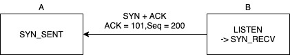

# TCP

사람 사이의 네트워킹에는 많은 일들이 생긴다. 조별 과제를 하는데 팀장이 잠수타거나, 출근 도중에 다리를 삐끗해서 출근을 못할 수도 있다. 컴퓨터 네트워크도 마찬가지인데 모바일로 온라인 동영상을 보면서 LTE 신호가 안 통하는 엘리베이터를 탈 수도 있고, 고양이가 선을 갉아먹어서 신호가 정상적으로 전달이 안되는 경우도 많다. 그런 경우마다 어플리케이션에서 처리해야 할까? 그렇지 않다. TCP는 어플리케이션 간의 `신뢰성 있는 데이터 전송`을 하기 위한 프로토콜이다. 여기서 말하는 '신뢰성'을 위해서는 TCP 이전에 알아야 할 지식이 있다.

## 회선 교환 vs 패킷 교환

네트워크 전송 방식에는 2가지가 있다. 회선 교환(Circuit Switching) 방식과 패킷교환(Packet Switching) 방식이다. 회선 교환방식은 쉽게 생각하면 유선 전화라고 생각하면 된다. 통화가 연결되면 상대방과 내 사이에 전용 통신선이 생기고 통화가 끝날 때까지 이 통신선이 없어지거나 다른 통화와 공유가 되지 않는다. 반면 패킷교환 방식은 우편이라고 생각하면 된다. 하고 싶은 말을 여러 편지에 나눠서 보낸다. 물론 중간에 없어질 수도 있으며 두 번째 보낸 편지가 첫 번째 보낸 편지보다 먼저 도착할 수도 있다.

인터넷 네트워크는 회선 교환 방식을 사용하지 않고 패킷 교환 방식을 사용하여 데이터를 보낸다. 회선 교환 방식을 사용한다면 네트워크에 참여하는 단말이 많으면 많아질수록 회선 수를 급격하게 늘려야 한다. 반면 패킷 교환 방식은 여러 사람의 데이터를 패킷 형태로 한 회선에서 사용할 수 있다. 

| | 회선 교환 | 패킷 교환 |
| - | - | - |
| 회선 | 전용 회선 | 공유 회선 |
| 장점 | 속도, 신뢰성 | 효율 |
| 단점 | 효율성 | 속도, 신뢰성 |

아까 귀여운 강아지 사진을 보았을텐데, 이 사진의 크기가 100 KB라 가정해보자. 이론상 한 번에 보낼 수 있는 TCP세그먼트의 크기는 65KB이라서 100KB라면 2개로 쪼개서 보낼 수 있을 것이다. 하지만 보통 OS에서 설정한 MTU(Maximum Transmission Unit)값을 따른다. 이 값은 보통 1500바이트인데, 네트워크 인터페이스에서 분할(세그먼트) 없이 보낼 수 있는 최대 크기이다. 보통 IP헤더 20바이트, TCP 헤더 20바이트 뺀 1460바이트씩 보낼 수 있다. 따라서 강아지 사진을 한 장 받기 위해서는 데이터를 전송하는 측에서는 수 천 ~ 수 만 개의 TCP세그먼트로 분할하고 받는 호스트에서는 분할된 TCP세그먼트를 조합한다.      

## TCP 데이터 전송 프로세스

TCP로 어플리케이션간 데이터 전송은 크게 아래 절차를 통해 진행된다. 

```
TCP 연결 맺기 -> 어플리케이션 사이에 데이터 송수신 -> TCP 연결 끊기
```

### 0. 메시지 타입

| 메시지 | 설명 |
| -- | -- |
| SYN | Synchronize Sequence Number의 약자. 연결 초기화 및 연결 성립에 사용된다. 두 기기 사이에 시퀀스 번호(Sequence Number)라는 데이터를 동기화할때도 사용한다. |
| ACK | Acknowledgement의 약자. SYN 메시지를 받은 쪽에서 잘 받았다고 확인할때 보내준다. |
| FIN | 연결을 종료할때 사용한다. |

### 1. TCP 연결 맺기
통신 상대방과 자신 양쪽 모두 데이터 전송할 준비가 되었다는 것을 확인하고 `3웨이 핸드셰이크`라고 불리는 과정을 통해 `논리적인 연결`을 맺는 과정이다. 회선 교환처럼 물리적 연결을 맺는게 아니다. `3웨이 핸드셰이크`라는 용어가 영어라서 어렵게 생각할 수도 있겠지만 전화 거는 행위와 같다고 생각하면 쉽다. (읽을 때는 `삼 웨이 핸드셰이크`가 아니라 `쓰리 웨이 핸드셰이크`라고 읽어야 한다 ㅠㅠ. 혹시나 해서요...)

발신자 A, 수신자(콜센터) B의 경우 통화 프로세스가 보통 아래와 같을 거다. 생각하는 것과 달라도 그렇다고 알고 가자.

```
A: (전화를 건다)
B: 안녕하세요, ㅇㅇㅇ 입니다.
A: 네, 전 XXX 인데요, 이거이거에 대해서 설명해주세요
.....
```

웹브라우져 A와 웹서버 B와의 통신도 이와 유사하다. 

  1. A -> B   
  전화 거는 상황이다. A가 B에게 SYN 메시지 전송한다. A는 첫 연결 시 랜덤한 숫자(시퀀스 번호)를 같이 보낸다. 여기서는 100이라고 하겠다. A의 상태는 `SYN_SENT`가 된다.    
  
  1. B -> A   
  B가 "안녕하세요 ㅇㅇㅇ입니다" 하는 상황이다. 콜센터처럼 웹서버B는 언제나 80포트가 열려있는 상태이기 때문에 B는 메시지를 받을 수 있다. 보통 LISTEN 상태라고 한다. 메시지를 받은 B는 A도 포트를 열라는 메시지(SYN + ACK)를 전송하는데 ACK를 100 + 1인 101을 보내고 자신의 시퀀스 번호를 태워 보낸다. 여기서는 200이라고 하자. 그 후 B는 `SYN_RECV` 상태가 된다.   
  
  1. A -> B   
  A가 "네, 전 XXX인데요"까지 말하는 상태이다. SYN+ACK 메시지를 받은 A는 웹 서버에게 난 준비되었고 잘 받았다는 메시지를 보낸다. A는 시퀀스 번호를 101, ACK 번호를 B가 보낸 시퀀스 번호 200에 1을 더해서 보낸다. A의 상태는 `ESTABLISHED` 가 되며 이 메시지를 받은 B도 `ESTABLISHED` 상태로 바뀐다. 이렇게 연결이 성립(ESTABLISHED)된 후 데이터를 주고 받게 된다.   
     

  전체적으로 보면 아래와 같다.    
  

### 2. 어플리케이션 사이에 데이터 송수신

전화로 치면 용건을 이야기하는 단계이고 컴퓨터는 데이터를 주고 받는 단계이다. 아까 콜센터를 예로 들었는데 OOO에 대해서 설명해달라고 하면 콜센터는 계속 설명을 할 것이다. 근데 A가 아무 응답 없이 듣고만 있다면 "여보세요? 제 말 듣고 계세요?" 몇 번 확인하다가 끊어버릴 것이다. A는 중간 중간에 잘 듣고 있다는 "예", "네네" 등의 추임새를 넣어줘야한다. TCP 통신도 마찬가지라서 A에서 데이터를 주면 B는 잘 받았다는 추임새 - ACK를 던져줘야 한다.

### 3. TCP 연결 끊기
연결을 맺는 과정처럼 연결을 해제하는 과정도 절차가 있다. 연결을 해제하기 위해 4번의 통신이 필요하기 때문에 `4웨이 핸드셰이크`라고 한다. 이 부분은 3웨이 핸드셰이크와 큰 차이가 없기 때문에 설명을 생략한다. 분량이 남으면 추가해서 넣도록 한다.

축하한다. 여러분은 아래와 같은 TCP Joke 를 이해할 수 있게 되었다.


## 오류 제어, 흐름 제어, 혼잡 제어

TCP로 통신을 하면 몇 가지 문제가 발생한다. 

첫 번째, 먼저 전송한 패킷이 늦게 도착하거나 일부 패킷이 도착하지 않을 수도 있다. 앞서 서버에서 귀여운 강아지 사진을 전송하기 위해 사진 데이터를 분할해서 보낸다고 했다. 하지만 분할된 강아지 사진이 순서대로 클라이언트에게 도착한다는 보장이 없다. 또한 100번째 강아지 사진이 중간에 어디론가 증발해서 클라이언트에게 도착하지 않을 수도 있다.    

TCP가 이를 해결하는 방법이 바로 TCP를 `신뢰성`있는 프로토콜이라 부르는 이유가 된다. 이를 `오류 제어(Error Control)` 기법이라고 하며 데이터를 순서대로 정렬하며 못 받은 패킷이 있으면 재전송을 요청하는 등 최대한 데이터 손실이 없도록 노력하기 때문에 인터넷 계층 위의 어플리케이션 개발자가 데이터 송수신에 연연하지 않고 프로그래밍에 전념할 수 있다.   

두 번째, 데이터를 보내는 호스트가 데이터를 받는 호스트보다 데이터 처리 속도가 빠르면 문제가 된다. 그 반대의 경우는 상관이 없다. 데이터를 받는 측에서는 버퍼라고 하는 일종의 공간을 사용하여 받은 데이터를 임시 보관한다. 그런데 이를 처리하기도 전에 데이터가 물밀듯이 들어온다면 버퍼에 담기지 못하는 데이터는 손실된다.   

이를 위해 TCP에서는 `흐름 제어(Flow Control)`라는 기법을 사용한다. 자세한 설명은 [영문판 위키피디아](https://en.wikipedia.org/wiki/Flow_control_(data))를 참조한다.    

세 번째, 네트워크가 혼잡할 경우에는 데이터가 손실되거나 처리속도가 눈에 띄게 떨어질 수 있다.    

이를 위해 TCP에서는 `혼잡 제어(Congestion Control)`라는 기법을 사용한다. 자세한 설명은 [위키피디아](https://ko.wikipedia.org/wiki/%ED%98%BC%EC%9E%A1_%EC%A0%9C%EC%96%B4)를 참조한다.

