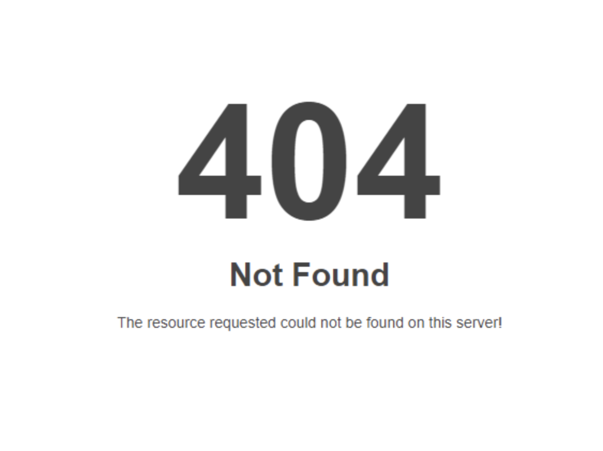

# 상태 코드(Status Code)

프로그래머가 아닌 일반인이라도 인터넷을 돌아다니다보면 위와 같은 화면을 가끔 접하셨을 겁니다. 500 Internal Server Error, 404 Not Found 등등의 글자와 말이죠. 이는 HTTP의 상태코드입니다. HTTP의 모든 요청에는 응답이 오는데 이 응답에는 상태를 나타내는 숫자가 있고 이를 `상태 코드`라고 합니다.

`상태 코드`는 3자리 숫자에 불과하지만 굉장히 중요한 역할을 합니다. 클라이언트는 이 상태 코드를 참고해서 에러 메시지를 띄우거나, 사용자의 요청을 처리합니다. 그렇기 때문에 서버 입장에서는 요청에 대한 상태 코드를 잘 선택해야 합니다.

## HTTP에서의 상태 코드의 위치

서버 등에서 반환하는 응답 내용에서 상태 코드는 맨 첫 번째 줄에 위치합니다. 첫 번째 줄에는 `HTTP 버전`, `상태 코드`, `상태 메시지`가 명시되어 있습니다.

여기서 중요한건 `상태 코드`의 숫자입니다. `상태 메시지`는 상태 코드에 대한 **짧은** 설명일 뿐이고 클라이언트의 동작에 아무 영향을 끼치지 않습니다.

## 상태 코드의 대분류

상태 코드를 서버마다 제각각으로 쓴다면 곤란합니다. 따라서 상태코드는 `RFC 2616`에 그 내용이 정의되어 있으며, IANA가 현재 [공식 HTTP 상태 코드 레지스트리](http://www.iana.org/assignments/http-status-codes/http-status-codes.xhtml)를 관리하고 있습니다. 상태코드는 첫 번째 자리의 숫자에 따라 크게 5가지 동작으로 구분할 수 있습니다.

### 조건부 응답(1xx)

서버는 클라이언트의 요청을 받았으며 작업을 계속 진행하고 있음을 의미합니다. 클라이언트는 그냥 요청을 계속하던지, 서버의 요청에 따라 프로토콜을 업데이트 해야합니다.

### 성공(2xx)

서버는 클라이언트의 요청을 확실히 이해했고, 성공적으로 이를 처리했음을 의미합니다.

### 리다이렉트(3xx)

다른 리소스로 리다이렉트를 의미합니다. 클라이언트는 3XX 상태코드가 담긴 응답을 받았을때 다른 리소스로 이동해야 합니다.

### 클라이언트 에러(4xx)

에러가 났는데, 원인 제공자는 클라이언트라는 점을 의미합니다. 보통 클라이언트가 규격에 맞지 않는 데이터를 보냈을 경우입니다. 서버 개발자 입장에서 볼때는 "니가 잘못했다", 클라이언트 개발자 입장에서 볼 때는 "내가 잘못했나?"로 요약할 수 있습니다.

### 서버 에러(5xx)

에러가 났는데, 원인 제공자는 서버라는 점을 의미합니다. 클라이언트는 유효한 요청을 보냈지만 서버 측의 과실로 생긴 에러입니다. 서버 개발자 입장에서 볼때는 "내가 잘못했다", 클라이언트 개발자 입장에서 볼 때는 "서버 똑바로 안하냐?" 로 요약할 수 있습니다.

## 자주 사용하는 상태 코드

표준으로 정의된 상태 코드는 줄잡아 수 십개나 되지만, 현업에서는 모든 상태코드를 다 사용하지 않습니다. 주로 아래와 같은 상태 코드만 사용합니다.

### 200 OK

요청이 성공했음을 의미합니다.

### 201 Created

리소스가 새로 생성됨을 의미합니다. 보통 POST 요청에 대한 응답의 상태 코드로서 사용되며, 응답 바디에는 새로 생성된 리소스의 정보가 들어가는 일이 많습니다.

### 301 Moved Permanently

클라이언트가 요청한 리소스가 **영구적**으로 새로운 URI로 이동했다는 사실을 의미합니다.

### 302 Found (혹은 Moved temporarily)

클라이언트가 요청한 리소스가 **임시**로 다른 URI로 이동했다는 사실을 의미합니다. SEO에서는 301과 302를 잘 써야합니다. 웹사이트 도메인을 변경했다면 301을 써야하며, 사이트 정비나 기타 문제로 임시로 이동했을 경우 302를 사용해야 합니다.

### 400 Bad Request

웹개발을 한다면 200과 함께 가장 많이 볼 상태 코드입니다. 클라이언트의 요청이 잘못되었다는 사실을 의미합니다.

### 401 Unauthorized

해당 리소스를 접근할때 적절한 인증 정보가 없다는 사실을 의미합니다.

### 403 Forbidden

클라이언트는 올바른 정보를 요청하고 유효한 인증 정보는 있지만 리소스를 접근하기에 충분한 **권한**을 가지지 못하고 있다는 사실을 알려줍니다. 401과 비슷합니다만 다른 점을 쉽게 설명하자면 출입카드가 없는 경우가 `401`이며, 지금 내가 가진 출입카드로 1급 비밀 보관소에 못들어가면 `403`입니다.

### 404 Not Found

클라이언트가 요청한 리소스가 없음을 의미합니다.

### 405 Method Not Allowed

클라이언트가 요청한 리소스가 있지만 HTTP 메소드가 다를 경우입니다. 예를 들어 서버에서는 `GET` `www.example.com` 만을 지원하지만 클라이언트가 `POST`로 보내는 경우가 이에 해당됩니다.

### 409 Conflict

리소스의 현재 상태와 클라이언트의 요청(주로 생성 및 업데이트)이 충돌이 날 경우를 의미합니다.

### 500 Internal Server Error

서버에 이상이 생겨서 요청에 대해 응답을 할 수 없음을 의미합니다.

### 503 Service Unavailable

서버가 클라이언트의 요청을 처리할 수 없음을 의미합니다. 서버 내부 설정을 잘못 했거나, 처리량이 너무 많아서 응답을 못해주는 등 이유야 여러가지가 있습니다.

전체 상태 코드는 [위키피디아](https://en.wikipedia.org/wiki/List_of_HTTP_status_codes)를 참고하시기 바랍니다.
